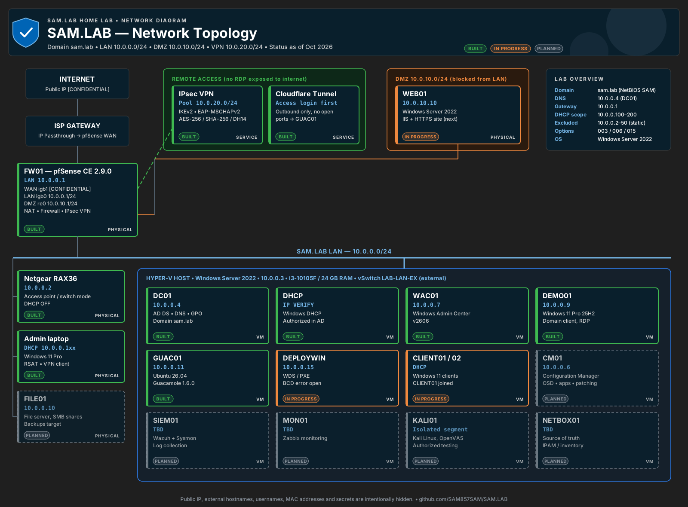
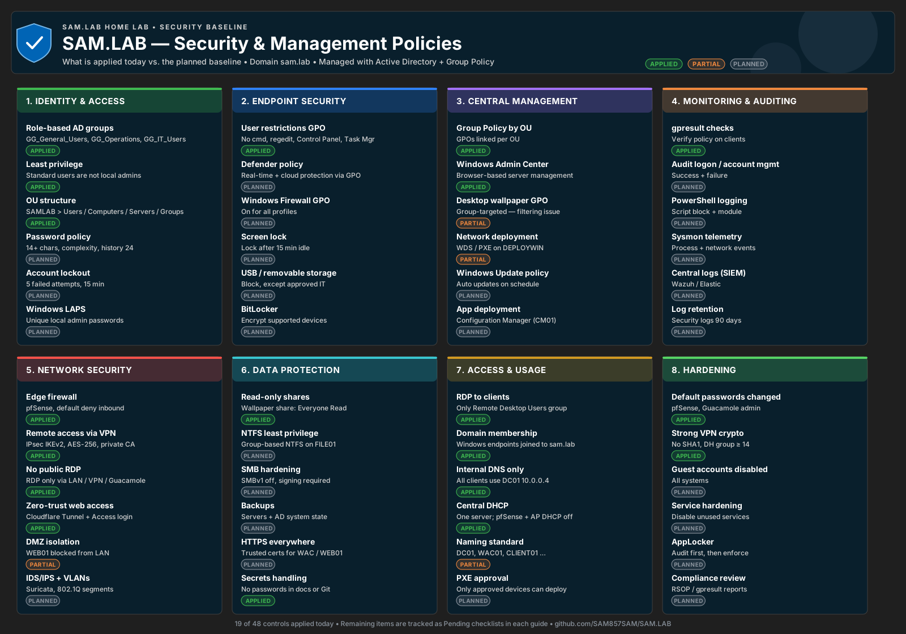
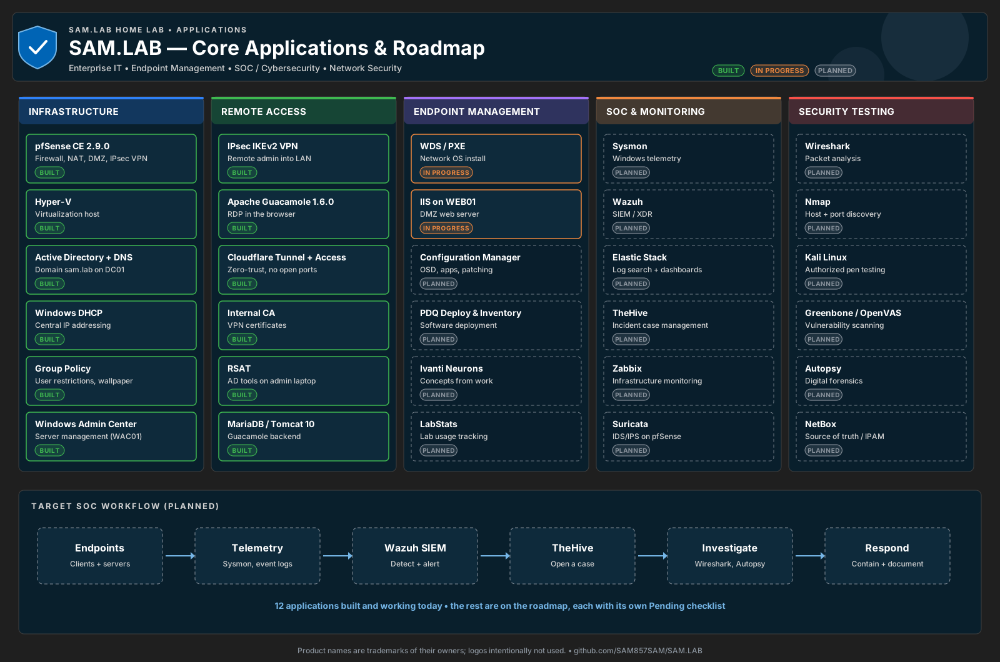
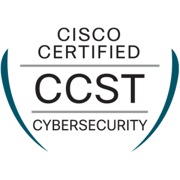
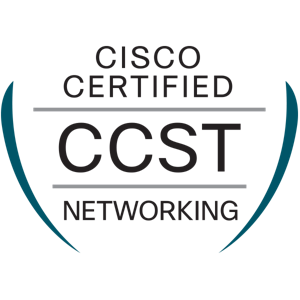
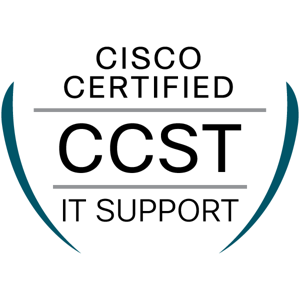
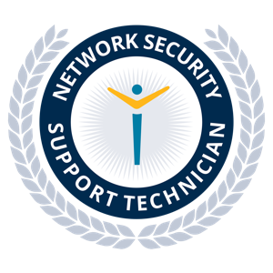
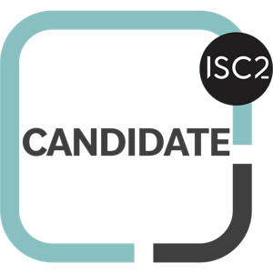

# SAM.LAB — Enterprise Home Lab

A small-enterprise network I built at home to practice real IT, networking, security, and forensics work.
Built by **Samual A. Michael** — IT Help Desk Support, Network & System Administration certificate holder and Cybersecurity & Network Engineering A.A.S. student (Saint Paul College), working toward **Cloud Security Engineer**.

> Sensitive values (public IP, external hostnames, VPN usernames, passwords, keys, MAC addresses) are replaced with `[CONFIDENTIAL]` or blurred. Screenshots that showed passwords are not published.

---

## Network at a glance

| Segment | Network | Gateway | Purpose |
|---|---|---|---|
| LAN | 10.0.0.0/24 | 10.0.0.1 (pfSense) | AD, servers, clients |
| DMZ | 10.0.10.0/24 | 10.0.10.1 (pfSense) | Isolated web server |
| VPN pool | 10.0.20.0/24 | pfSense IPsec | Remote admin clients |
| WAN | `[CONFIDENTIAL PUBLIC IP]` | ISP (IP Passthrough) | Internet |

## Diagrams

### Network topology

### Security & management policies

### Applications & roadmap

> Editable SVG versions are in [`diagrams/`](diagrams/).

## Systems

| Host | IP | Role | Status |
|---|---|---|---|
| FW01 | 10.0.0.1 | pfSense CE 2.9.0 — firewall, NAT, DMZ, IPsec VPN | ✅ Built |
| Netgear RAX36 | 10.0.0.2 | Wi-Fi access point / switch (DHCP off) | ✅ Built |
| Hyper-V host | 10.0.0.103 | Windows Server 2022, runs all VMs (workgroup) | ✅ Built |
| DC01 | 10.0.0.4 | AD DS, DNS, Group Policy (`sam.lab`) | ✅ Built |
| DHCP01 | 10.0.0.20 | Windows DHCP, scope .100–.200 | ✅ Built |
| WAC01 | 10.0.0.7 | Windows Admin Center 2606 | ✅ Built |
| DEMO01 | 10.0.0.9 | Windows 11 domain client | ✅ Built |
| GUAC01 | 10.0.0.11 | Apache Guacamole 1.6.0 + Cloudflare Tunnel | ✅ Built |
| FOR01 | 10.0.0.12 | Forensics VM — Autopsy 4.23.1, HxD | ✅ Built · hardening 🟠 |
| DEPLOYWIN | 10.0.0.15 | WDS / PXE | 🟠 In progress |
| CLIENT01 / 02 | DHCP | Windows 11 clients | 🟠 CLIENT01 joined |
| FILE01 | 10.0.0.10 | File server | 🟠 In progress |
| WEB01 | 10.0.10.10 | Windows Server 2022 in DMZ | 🟠 In progress |
| CM01 | 10.0.0.6 | Configuration Manager | 🟠 Not confirmed |
| SIEM01 / MON01 / KALI01 | — | Wazuh, Zabbix, Kali | ⚪ Planned |

## Guides — step by step, with the real errors and fixes

| Area | Guide | Status |
|---|---|---|
| Networking | [FW01 pfSense firewall](docs/01-networking/pfsense.md) | ✅ |
| Networking | [Netgear RAX36 AP mode](docs/01-networking/netgear-ap-mode.md) | ✅ |
| Networking | [IPsec VPN (IKEv2)](docs/01-networking/ipsec-vpn.md) | ✅ |
| Networking | [Remote Desktop over the VPN](docs/01-networking/rdp-over-vpn.md) | ✅ |
| Networking | [Windows DHCP (DHCP01)](docs/01-networking/dhcp.md) | ✅ |
| Networking | [DMZ + WEB01 web server](docs/01-networking/dmz-web01.md) | 🟠 |
| Active Directory | [DC01, OUs, groups, domain join](docs/02-active-directory/dc01-active-directory.md) | ✅ |
| Active Directory | [Group Policy](docs/02-active-directory/group-policy.md) | 🟠 |
| Deployment | [WDS / PXE](docs/03-deployment/wds-pxe.md) | 🟠 |
| Servers | [Hyper-V host](docs/04-servers/hyper-v.md) | ✅ |
| Servers | [Windows Admin Center + RSAT](docs/04-servers/windows-admin-center.md) | ✅ |
| Servers | [Apache Guacamole](docs/04-servers/guacamole.md) | ✅ |
| Servers | [Cloudflare Tunnel + Access](docs/04-servers/cloudflare-tunnel.md) | ✅ |
| Security / SOC | [FOR01 forensics VM + Autopsy](docs/05-security-soc/for01-autopsy.md) | ✅ |
| Troubleshooting | [Wallpaper GPO "Denied (Security)"](docs/07-troubleshooting/wallpaper-gpo.md) | 🔴 Open |
| Troubleshooting | [PXE "\Boot\BCD 0xc000000f"](docs/07-troubleshooting/pxe-boot.md) | 🔴 Open |

Every guide ends with a **📋 Pending** checklist of what's not built yet.

## 📋 Pending roadmap
- [ ] **DMZ + WEB01:** IIS, sample site, HTTPS, DMZ → LAN deny-all, LAN/VPN-only admin
- [ ] Fix PXE BCD 0xc000000f (remove DHCP 066/067, custom WinPE image)
- [ ] Fix wallpaper GPO (fresh logon, Apply permission, correct UNC path)
- [ ] FOR01 hardening: BitLocker C:, recovery keys, Defender exclusions, own network segment
- [ ] Hyper-V host static IP 10.0.0.3; separate data SSD
- [ ] LAN move to 10.10.0.0/24
- [ ] CM01 / Configuration Manager
- [ ] AD security baseline (passwords, lockout, LAPS, USB, auditing)
- [ ] SOC: Sysmon, Wazuh, Elastic, TheHive, Zabbix
- [ ] Security tools: Kali, OpenVAS, Suricata, Wireshark/Nmap labs
- [ ] RODC, FILE01 shares, ownCloud, NetBox

## Skills shown

Windows Server 2022 · Hyper-V · Active Directory · DNS · DHCP · Group Policy · WDS/PXE · pfSense · NAT · DMZ segmentation · IKEv2/IPsec VPN · PKI (internal CA) · Zero-trust remote access (Cloudflare Tunnel + Access) · Linux (Ubuntu, LVM, build from source) · Tomcat / MariaDB · Digital forensics (Autopsy) · PowerShell · Troubleshooting & documentation

## Certifications

| Certification | Proven in this lab |
|---|---|
| Cisco CCST Networking ✅ | [pfSense](docs/01-networking/pfsense.md), [DHCP](docs/01-networking/dhcp.md), subnets, NAT |
| Cisco CCST Cybersecurity ✅ | [IPsec VPN](docs/01-networking/ipsec-vpn.md), [DMZ](docs/01-networking/dmz-web01.md), [forensics](docs/05-security-soc/for01-autopsy.md) |
| Cisco CCST IT Support ✅ | [Active Directory](docs/02-active-directory/dc01-active-directory.md), [GPO](docs/02-active-directory/group-policy.md), troubleshooting |
| CCNA 200-301 📘 Studying | Routing, VPN, firewall rules |
| Security+ / AWS 🎯 Next | Toward **Cloud Security Engineer** |

All badges verify on Credly — click them. Full profile: **[github.com/SAM857SAM](https://github.com/SAM857SAM)** • **[samyord.com](https://samyord.com)**
