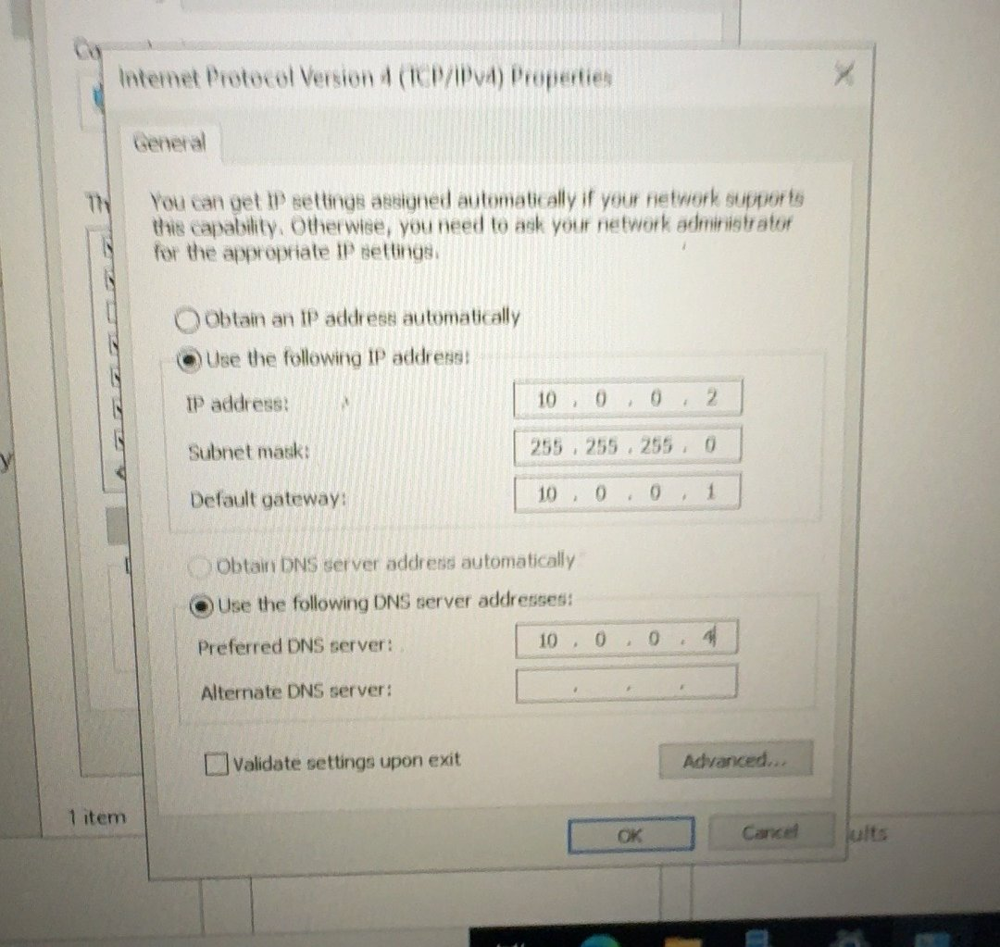
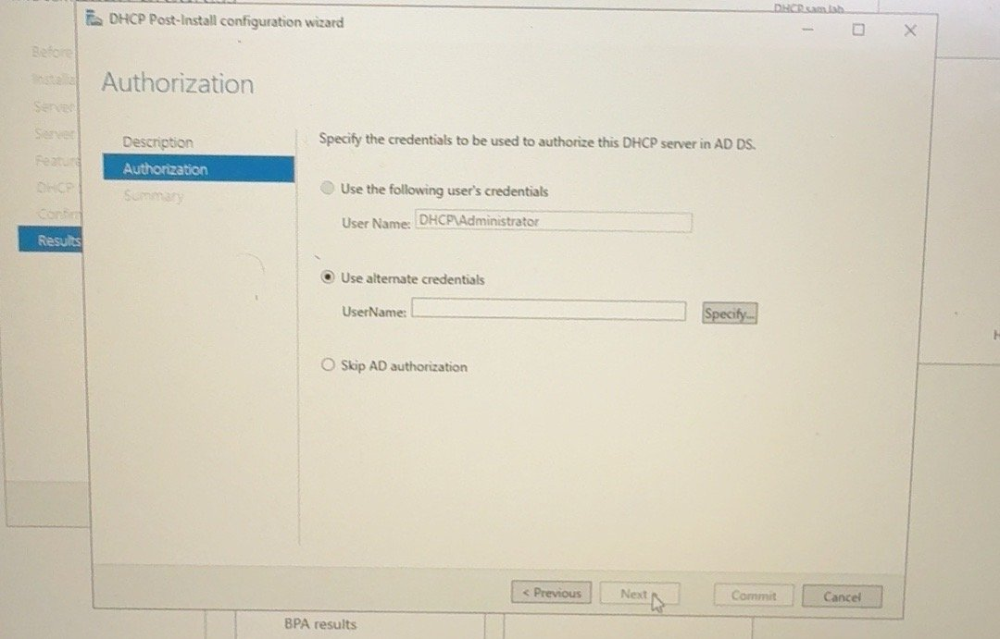
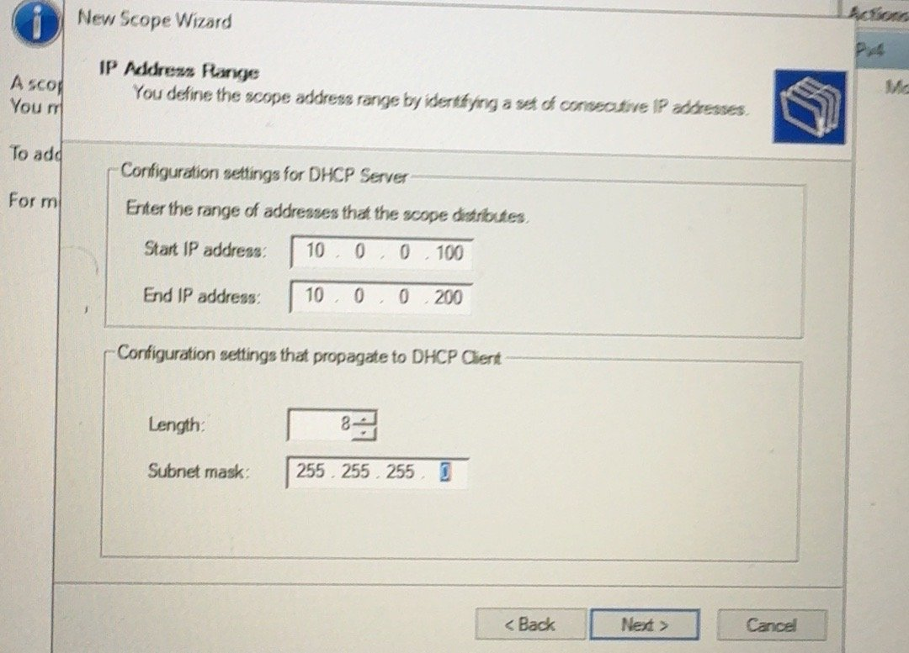
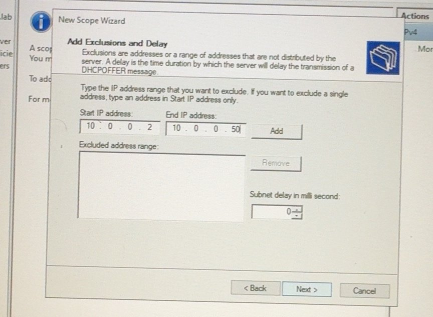
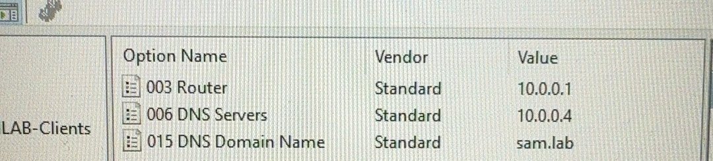
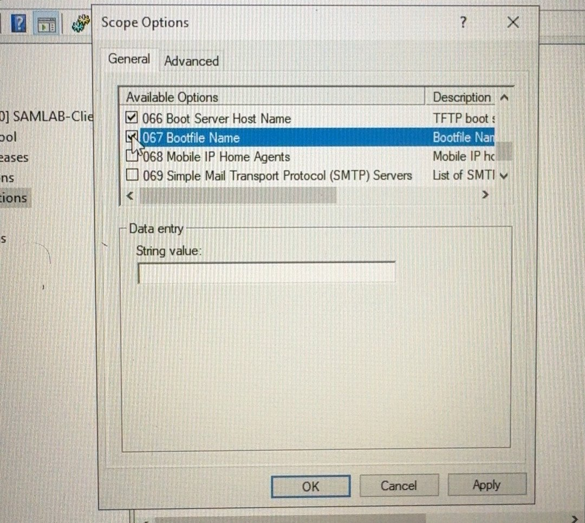
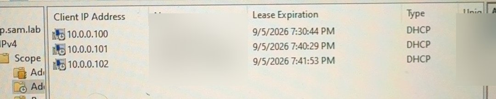

# Windows DHCP Server — Step by Step

**Goal:** One central DHCP server that gives clients the right IP, gateway, DNS, and domain.
**Status:** ✅ Built
**Server:** DHCP01 — Hyper-V VM named `DHCP`, hostname `dhcp.sam.lab` · **10.0.0.20** · Windows Server 2022, joined to `sam.lab`

| Setting | Value |
|---|---|
| Scope name | SAMLAB-Clients |
| Range | 10.0.0.100 – 10.0.0.200 /24 |
| Exclusion | 10.0.0.2 – 10.0.0.50 (servers and devices) |
| Lease | 8 days |
| 003 Router | 10.0.0.1 (pfSense) |
| 006 DNS | 10.0.0.4 (DC01) |
| 015 Domain | sam.lab |

---

## Step 1 — Static IP on the DHCP server
A DHCP server must never get its own address from DHCP.
1. **Network Connections > Ethernet > Properties > IPv4**.
2. IP `10.0.0.20`, mask `255.255.255.0`, gateway `10.0.0.1`, DNS `10.0.0.4`.



> ⚠ **Watch out:** An early screenshot shows the server at 10.0.0.2, the same IP as the Netgear AP. Two devices with one IP = conflict. The server was moved to **10.0.0.20**.

## Step 2 — Install the role
```powershell
Install-WindowsFeature DHCP -IncludeManagementTools
```

## Step 3 — Authorize in Active Directory
1. In Server Manager, click the flag → **Complete DHCP configuration**.
2. **Authorization** → use a **domain admin** account (`SAM\Administrator`), not the local one → **Commit**.



Why: Only authorized DHCP servers can hand out leases in a domain. This stops rogue DHCP servers.

## Step 4 — Create the scope
1. **DHCP > IPv4 > New Scope**, name `SAMLAB-Clients`.
2. Start `10.0.0.100`, End `10.0.0.200`, length `24`.



3. Exclusions: `10.0.0.2` to `10.0.0.50`.



4. Lease duration **8 days**.
5. Router `10.0.0.1`, parent domain `sam.lab`, DNS `10.0.0.4`, **Activate the scope now**.

## Step 5 — Check scope options


## Step 6 — PXE options (for WDS)
1. **Scope Options > Configure Options**: **066 Boot Server Host Name** = `10.0.0.15`, **067 Bootfile Name** = boot file path.



> ⚠ **Heads-up:** Microsoft does **not** recommend 066/067 when WDS is on the same subnet as the clients — WDS answers PXE itself. These options are the #1 suspect in the open PXE error, see [PXE troubleshooting](../07-troubleshooting/pxe-boot.md).

## Step 7 — Turn off other DHCP servers
- pfSense: **Services > DHCP Server > LAN** → unchecked (see [pfSense guide](pfsense.md)).
- Netgear RAX36: **AP mode**, DHCP off.

---

## ✅ Check it worked
On a client:
```cmd
ipconfig /release
ipconfig /renew
ipconfig /all
```
You should see an IP in `10.0.0.100–200`, gateway `10.0.0.1`, DNS `10.0.0.4`, suffix `sam.lab`.

On the server: **Scope > Address Leases**.



## 📋 Pending (not built yet)
- [ ] Rename the VM/host to `DHCP01` to match the naming standard
- [ ] Reservation for GUAC01 (10.0.0.11) — it still uses DHCP
- [ ] DHCP reservations for printers / fixed clients
- [ ] DHCP failover (second server, load balance)
- [ ] Remove options 066/067 (PXE fix test)
- [ ] DHCP audit logs to SIEM
- [ ] Update scope after LAN move to 10.10.0.0/24
