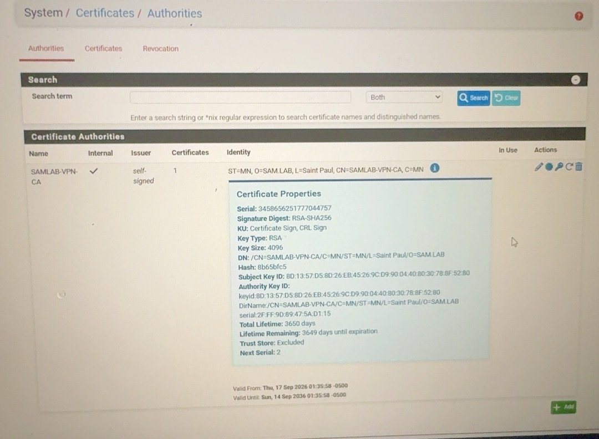
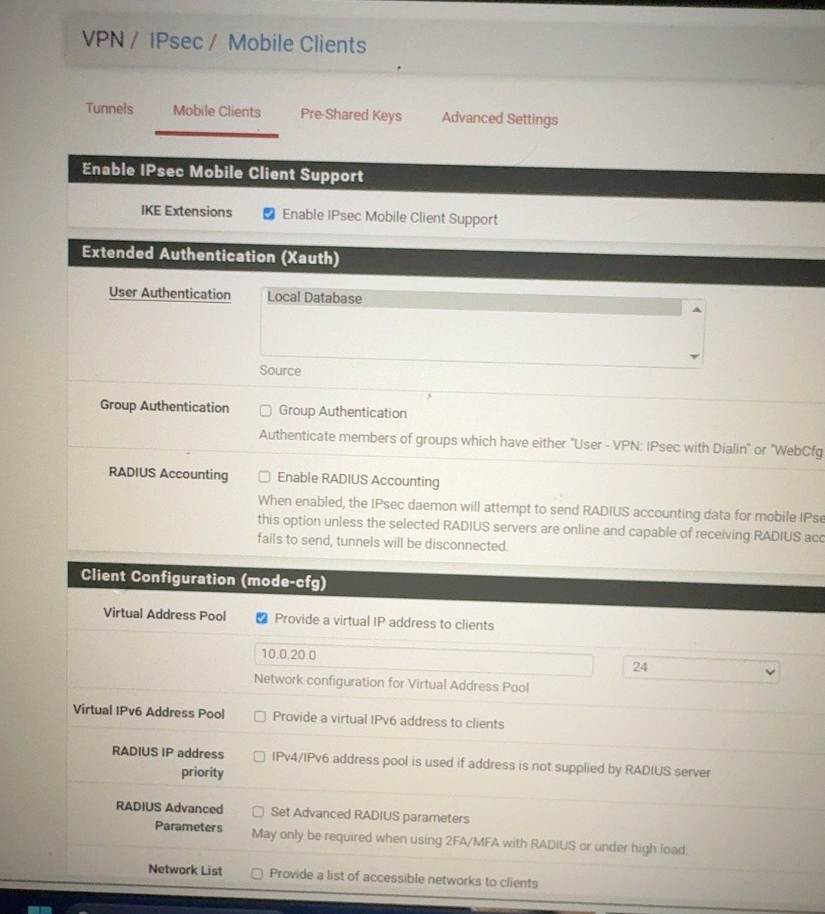
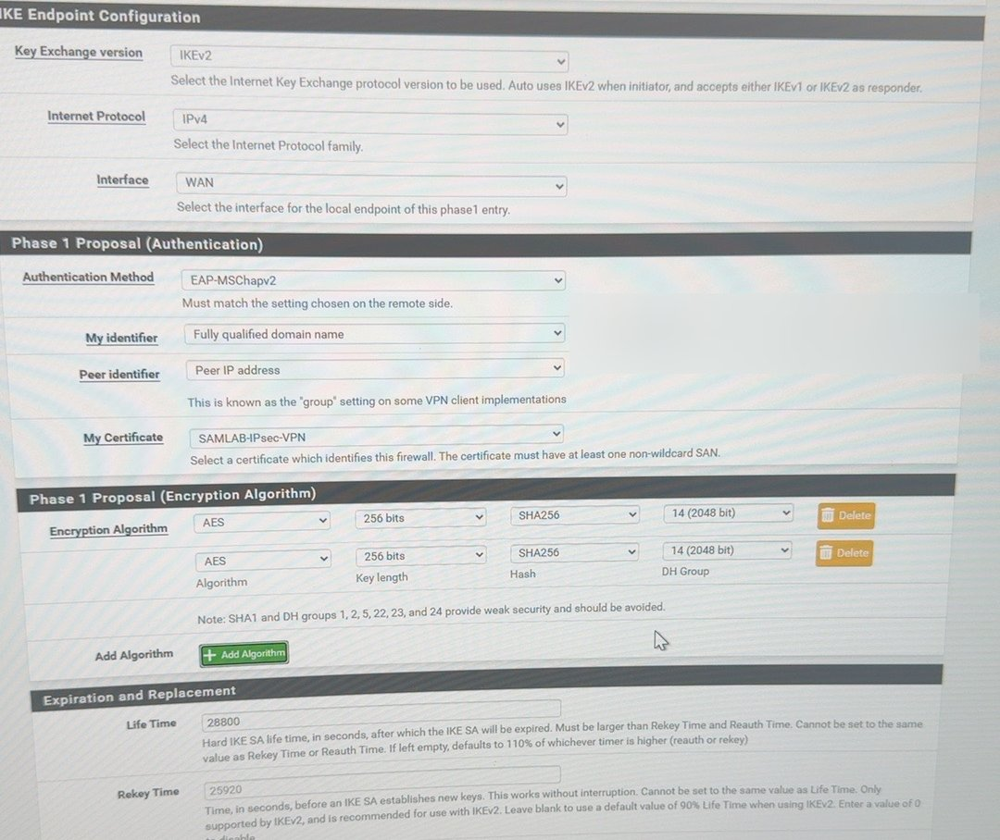
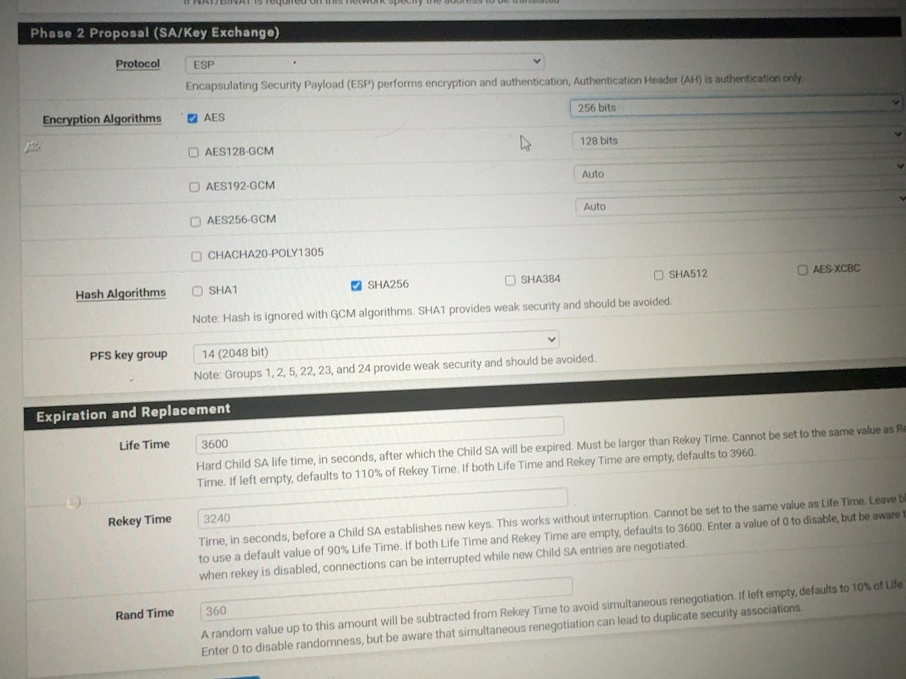
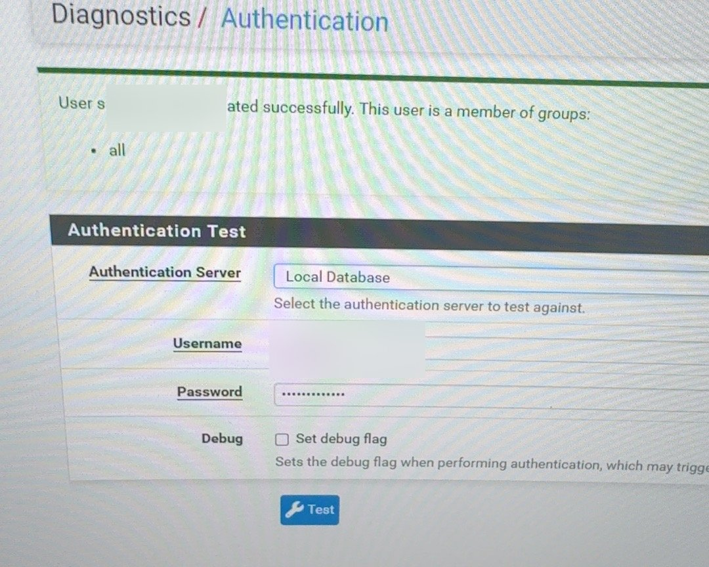
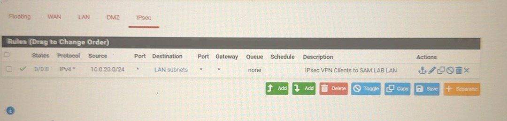
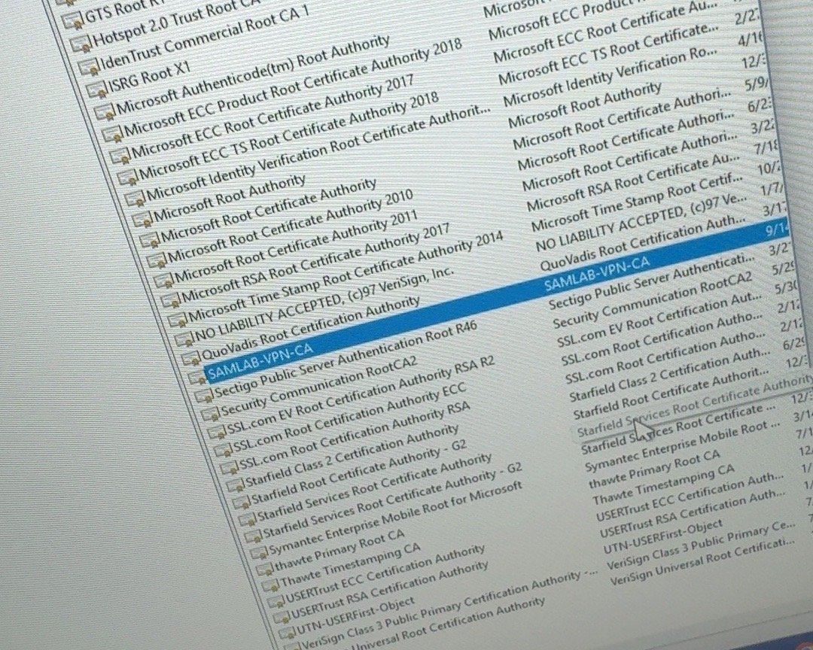
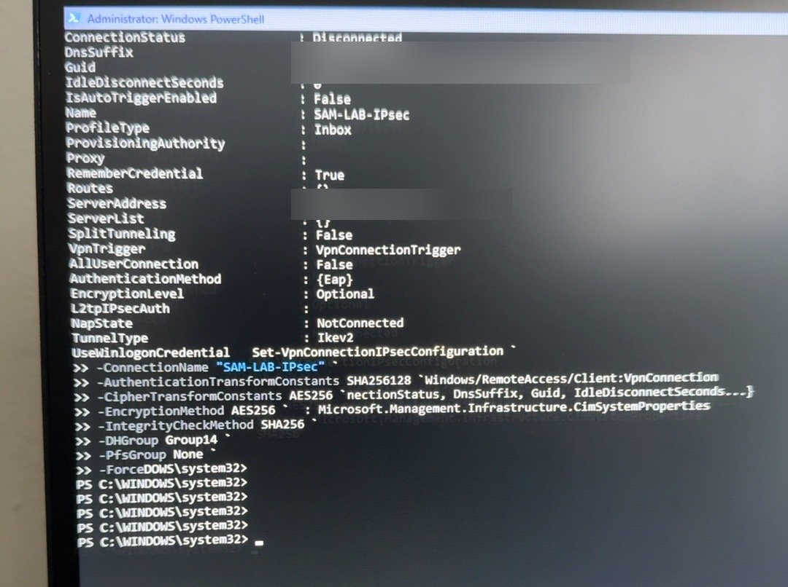
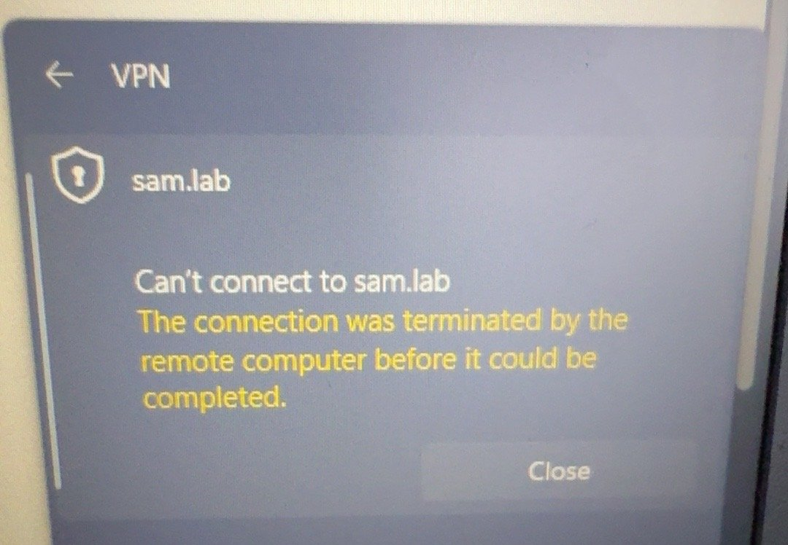
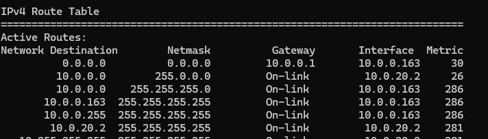

# IPsec Remote-Access VPN (IKEv2) — Step by Step

**Goal:** Reach the lab safely from anywhere, without opening RDP to the internet.
**Built on:** pfSense FW01 · **Client:** Windows 11 built-in VPN

| Setting | Value |
|---|---|
| Type | IKEv2, EAP-MSCHAPv2 |
| Server name | `[CONFIDENTIAL VPN HOSTNAME]` |
| VPN client pool | 10.0.20.0/24 |
| DNS pushed | 10.0.0.4 (DC01), domain `sam.lab` |
| Crypto | AES-256 / SHA-256 / DH group 14 |

---

## Step 1 — Create a Certificate Authority
1. **System > Cert Manager > CAs > Add**.
2. Method **Create an internal CA**, name `SAMLAB-VPN-CA`, RSA **4096**, SHA256, 3650 days.



## Step 2 — Create the server certificate
1. **System > Cert Manager > Certificates > Add**, method **Create an internal certificate**.
2. Name `SAMLAB-IPsec-VPN`, CA `SAMLAB-VPN-CA`, type **Server Certificate**.
3. Common Name **and** SAN = `[CONFIDENTIAL VPN HOSTNAME]` (must match what the client types).

## Step 3 — Mobile Clients
1. **VPN > IPsec > Mobile Clients**, check **Enable IPsec Mobile Client Support**.
2. User Authentication **Local Database**.
3. Virtual Address Pool `10.0.20.0/24`, DNS domain `sam.lab`, DNS server `10.0.0.4`.
4. **Save**, then click **Create Phase 1** when asked.



## Step 4 — Phase 1
1. Key Exchange **IKEv2**, Interface **WAN**.
2. Authentication **EAP-MSCHAPv2**, My identifier **FQDN** = `[CONFIDENTIAL VPN HOSTNAME]`.
3. My Certificate `SAMLAB-IPsec-VPN`.
4. Encryption **AES 256 / SHA256 / DH 14**, Life Time `28800`, MOBIKE on.



## Step 5 — Phase 2
1. Mode **Tunnel IPv4**, Local Network **LAN subnet** (10.0.0.0/24).
2. Protocol **ESP**, AES **256**, Hash **SHA256**, PFS **14**, Life Time `3600`.



## Step 6 — VPN user (EAP secret)
1. **VPN > IPsec > Pre-Shared Keys > Add**.
2. Identifier `[CONFIDENTIAL VPN USER]`, Secret type **EAP**, Pre-Shared Key = the user's password.

> ⚠ **Error:** *"The user name or password is incorrect."*
> **Fix:** EAP users go in **Pre-Shared Keys** with type **EAP**, not in System > User Manager.

> ⚠ **Error:** *"user already exists"* when saving.
> **Fix:** An entry was already there. **Edit** it instead of adding a new one.

Check it: **Diagnostics > Authentication** → user authenticated successfully.



## Step 7 — Firewall rules
1. **Firewall > Rules > IPsec > Add**: Pass, IPv4, source `10.0.20.0/24`, destination **LAN subnets**, description *IPsec VPN Clients to SAM.LAB LAN*.
2. **Firewall > Rules > WAN**: pass **UDP 500** (IKE) and **UDP 4500** (NAT-T) to **WAN address**.



## Step 8 — Windows client
1. Export `SAMLAB-VPN-CA` from pfSense. On the laptop, run `certlm.msc` and import it into **Trusted Root Certification Authorities** (Local Computer).



> ⚠ **Error:** pfSense log: *"received cert request for unknown ca"*.
> **Fix:** The CA was in the *user* store. Import it into the **Local Computer** store.

2. **Settings > Network & internet > VPN > Add VPN**: name `SAM-LAB-IPsec`, server `[CONFIDENTIAL VPN HOSTNAME]`, type **IKEv2**, sign-in **User name and password**.
3. Match pfSense's crypto (PowerShell as admin):
```powershell
Set-VpnConnectionIPsecConfiguration -ConnectionName "SAM-LAB-IPsec" `
  -AuthenticationTransformConstants SHA256128 -CipherTransformConstants AES256 `
  -EncryptionMethod AES256 -IntegrityCheckMethod SHA256 `
  -DHGroup Group14 -PfsGroup None -Force
```



> ⚠ **Error:** pfSense log: *"no acceptable ENCRYPTION_ALGORITHM found"*.
> **Fix:** Windows' default proposal is weak. The command above makes it match AES-256/SHA256/DH14.

> ⚠ **Error:** *"The connection was terminated by the remote computer before it could be completed."*
> **Fix:** pfSense WAN was behind the ISP's NAT. Turned on **IP Passthrough** on the ISP gateway so pfSense gets the real public IP (see [pfSense guide](pfsense.md)).



---

## ✅ Check it worked
Connect from **cellular / outside** (not from the lab Wi-Fi).
1. **Status > IPsec > Mobile** → user **online** with `10.0.20.x`.


2. On the laptop:
```cmd
route print
ping 10.0.0.4
nslookup sam.lab
```
`10.0.0.0` goes through the `10.0.20.x` VPN interface.



## 📋 Pending (not built yet)
- [ ] Certificate-based user auth (EAP-TLS) or MFA instead of password-only
- [ ] Limit VPN rule to needed ports (RDP, WAC, DNS) instead of all
- [ ] VPN logging to SIEM (Wazuh)
- [ ] Update Phase 2 after LAN move to 10.10.0.0/24
- [ ] Backup and document CA private key safely

## Security choices
- Strong crypto only (no SHA1, no DH < 14).
- Private CA trusted only on lab devices.
- RDP is reached through the VPN, never exposed to the internet.
