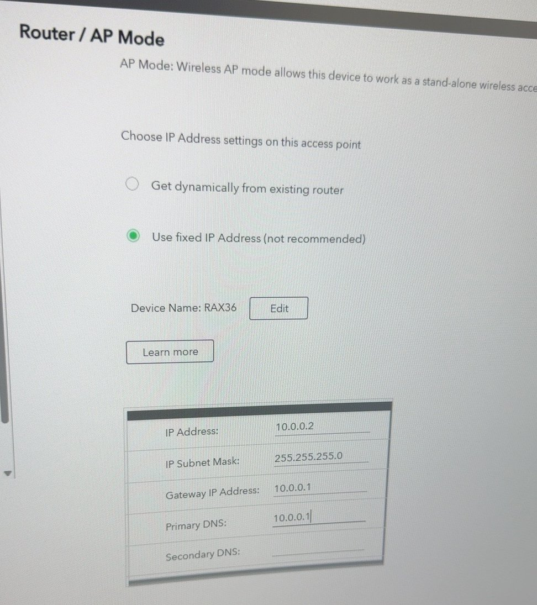

# Netgear RAX36 — Access Point Mode — Step by Step

**Goal:** Stop the home router from acting as a second router. Make it a plain Wi-Fi access point + switch behind pfSense.
**Status:** ✅ Built · **IP:** 10.0.0.2 (fixed)

Why: pfSense is the only gateway (10.0.0.1) and DHCP01 is the only DHCP server. If the Netgear stays in router mode, it hands out its own IPs and DNS, and clients can't find the domain.

---

## Step 1 — Open the Netgear admin page
Browse to the router's current IP and sign in.

## Step 2 — Switch to AP mode
1. **Advanced > Advanced Setup > Router / AP Mode** → **AP Mode**.
2. Choose **Use fixed IP Address**:

| Field | Value |
|---|---|
| IP Address | 10.0.0.2 |
| Subnet Mask | 255.255.255.0 |
| Gateway | 10.0.0.1 (pfSense) |
| Primary DNS | 10.0.0.1 |

3. **Apply**. The router restarts as an AP — its DHCP server is now **off**.



## Step 3 — Cable it
pfSense **LAN (igb0)** → any LAN port on the Netgear. Lab PCs and the Hyper-V host plug into the other Netgear ports.

---

## ✅ Check it worked
On a client:
```cmd
ipconfig /all
```
- DHCP Server = **10.0.0.20** (DHCP01), not the Netgear.
- Default gateway = **10.0.0.1**.

Open `http://10.0.0.2` → the Netgear page still loads (for management).

> ⚠ **Gotcha:** The DHCP server once also had a static 10.0.0.2 → IP conflict. Fixed by moving DHCP01 to **10.0.0.20**. Keep 10.0.0.2–10.0.0.50 excluded from the DHCP scope for devices like this.

## 📋 Pending (not built yet)
- [ ] Set AP DNS to 10.0.0.4 (DC01) if any device uses it directly
- [ ] WPA3 / strong Wi-Fi password, check firmware is current
- [ ] Separate guest / IoT Wi-Fi from the server LAN (VLANs)
- [ ] Change the default admin password and turn off remote management
- [ ] Update IP after LAN move to 10.10.0.0/24
