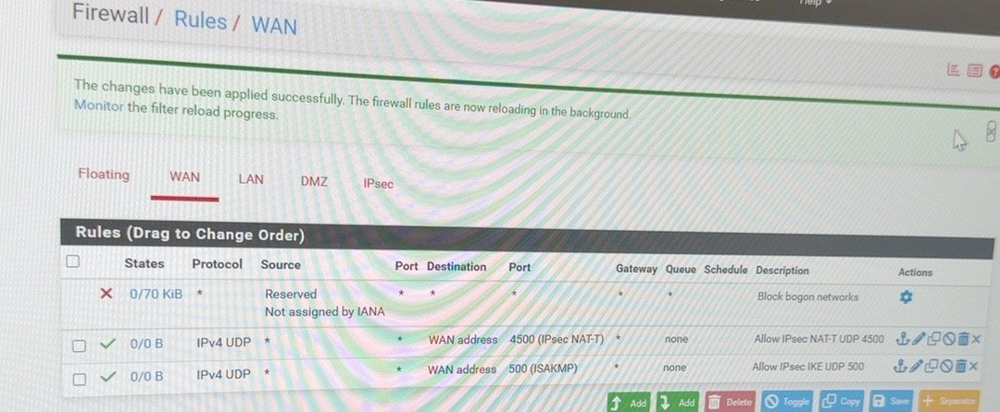

# FW01 — pfSense Firewall — Step by Step

**Goal:** Put a real firewall between the internet and the lab, with a separate DMZ.
**Status:** ✅ Built · **Version:** pfSense CE 2.9.0 · **Hostname:** FW01.sam.lab
**Hardware:** HP tower · Intel i3-10100 · 8 GB RAM · 256 GB SSD · Intel I350 dual-port NIC + onboard Realtek

| Interface | NIC | Address | Purpose |
|---|---|---|---|
| WAN | igb1 | `[CONFIDENTIAL PUBLIC IP]` (ISP IP Passthrough) | Internet |
| LAN | igb0 | 10.0.0.1/24 | Lab network |
| DMZ (OPT1) | re0 | 10.0.10.1/24 | Web server zone |

---

## Step 1 — Make the install USB
1. Download the pfSense CE **AMD64 memstick** installer from Netgate.
2. Write it to a USB drive with **Rufus** or **balenaEtcher**.

## Step 2 — Boot the installer
Plug the USB into FW01, open the BIOS boot menu, and pick the USB.

> ⚠ **Error:** *Secure Boot Violation — Invalid signature detected.*
> **Fix:** In BIOS, turn **Secure Boot off** but keep **UEFI** on. Boot again.


## Step 3 — Install and pick WAN
1. Accept the defaults and install to the SSD (ZFS).
2. At **WAN Interface Assignment**, choose the port marked **(active)** → `igb1`.


> 💡 Only the port cabled to the ISP shows **active**. That's how you know which one is WAN.

## Step 4 — Assign LAN and DMZ ports
LAN = `igb0`, OPT1 = `re0`. Check later in **Interfaces > Interface Assignments**.


## Step 5 — Setup wizard
1. From a LAN PC open `https://10.0.0.1` and accept the certificate warning (self-signed — normal).
2. Hostname `FW01`, domain `sam.lab`, time zone `America/Chicago`.
3. **Configure LAN Interface:** `10.0.0.1` / `24`.
4. Change the default admin password right away (the red banner reminds you).


> ⚠ **Error:** The old home router also used 10.0.0.1, so two gateways fought.
> **Fix:** Switched the Netgear RAX36 to **AP mode** at 10.0.0.2 with DHCP off — see [Netgear AP guide](netgear-ap-mode.md).

## Step 6 — Turn off DHCP on pfSense
**Services > DHCP Server > LAN** → uncheck **Enable DHCP server on LAN interface** → **Save**.
Windows DHCP01 hands out addresses for the domain. Two DHCP servers = wrong DNS and conflicts.


> ⚠ **Error:** DEMO01 got its IP and DNS **10.0.0.1** from pfSense, so it couldn't find the domain.
> **Fix:** This step — only DHCP01 serves the LAN, and it pushes DNS 10.0.0.4.

## Step 7 — Set up the DMZ
1. **Interfaces > OPT1 (re0)** → check **Enable**, description `DMZ`.
2. **Static IPv4** `10.0.10.1/24`, upstream gateway **None** → **Save > Apply Changes**.


## Step 8 — DMZ firewall rules
**Firewall > Rules > DMZ**:
1. **Block** source `10.0.10.10` (WEB01) → destination `10.0.0.0/24` — *BLOCK WEB01 TO SAM.LAB LAN*.
2. **Pass** ICMP `10.0.10.10` → **DMZ address** — *WEB01 TO DMZ Gateway - ICMP*.


## Step 9 — Public IP (ISP IP Passthrough)
1. On the ISP gateway: **Firewall > IP Passthrough** → Allocation **Passthrough**, mode **DHCPS-fixed**, pick pfSense's WAN MAC.
2. Restart the pfSense WAN. **Status > Interfaces** now shows WAN = `[CONFIDENTIAL PUBLIC IP]`.

> ⚠ **Error:** WAN had a private 192.168.1.75 address (double NAT), so the VPN could not be reached from outside.
> **Fix:** IP Passthrough gives pfSense the real public IP.

## Step 10 — WAN rules for the VPN
**Firewall > Rules > WAN**: keep **Block private networks** and **Block bogon networks** on, then add:
- Pass **UDP 500** (IKE/ISAKMP) → WAN address
- Pass **UDP 4500** (IPsec NAT-T) → WAN address



---

## ✅ Check it worked
On the console: **7) Ping host** → `8.8.8.8`.


On a LAN PC with **Wi-Fi turned off**:
```cmd
ipconfig /all
ping 10.0.0.1
tracert 8.8.8.8
```
Gateway `10.0.0.1`; the first `tracert` hop is `10.0.0.1`.

> ⚠ **Gotcha:** Ping worked even when pfSense was broken — the laptop was quietly using Wi-Fi. Turn Wi-Fi off when you test.

## 📋 Pending (not built yet)
- [ ] DMZ: reject **whole DMZ → RFC1918**, not just WEB01's IP (see [DMZ guide](dmz-web01.md))
- [ ] Narrow the IPsec rule (VPN → only needed ports, not *any*)
- [ ] Scheduled config backup (**Diagnostics > Backup & Restore**)
- [ ] Remote syslog to the future SIEM
- [ ] Switch DHCP backend ISC → **Kea** (ISC is end-of-life in pfSense)
- [ ] Suricata IDS/IPS
- [ ] Aliases + rule naming standard
- [ ] VLANs and an isolated segment for FOR01 / KALI01
- [ ] LAN move to 10.10.0.0/24

## Security choices
- No RDP or admin ports open on WAN — only IPsec (UDP 500/4500).
- DMZ cannot reach the LAN.
- One DHCP server only.
- Default password changed.
