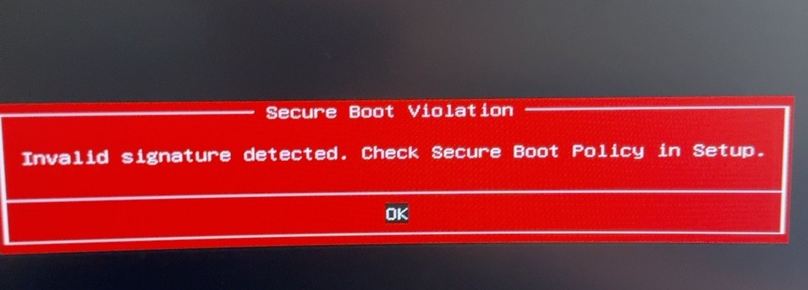
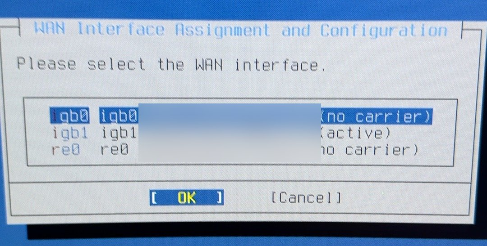
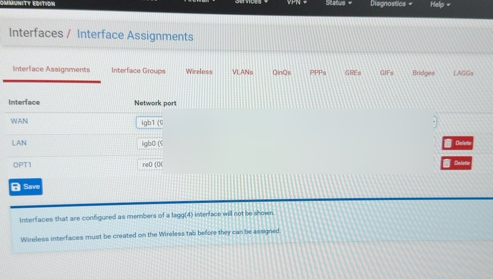
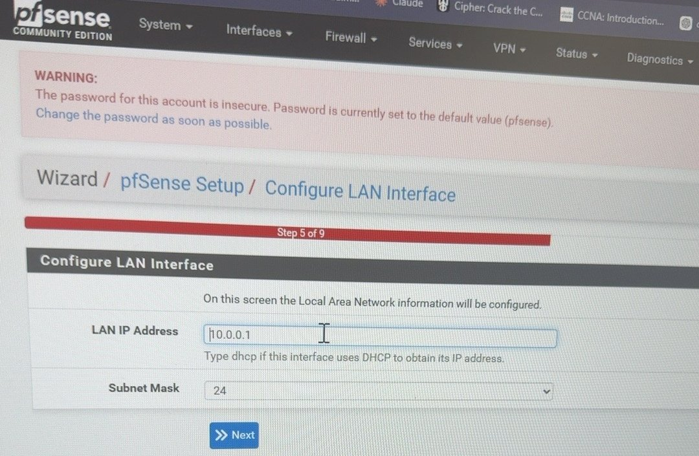
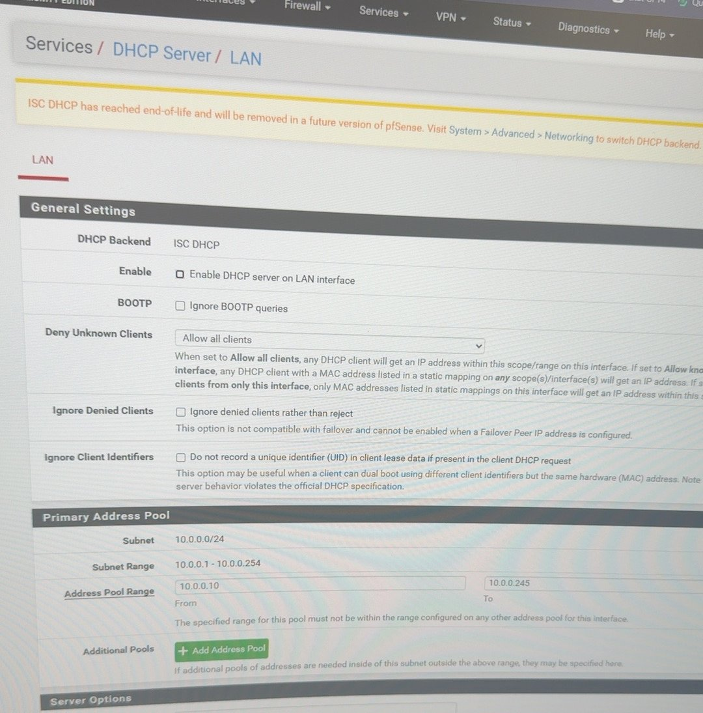
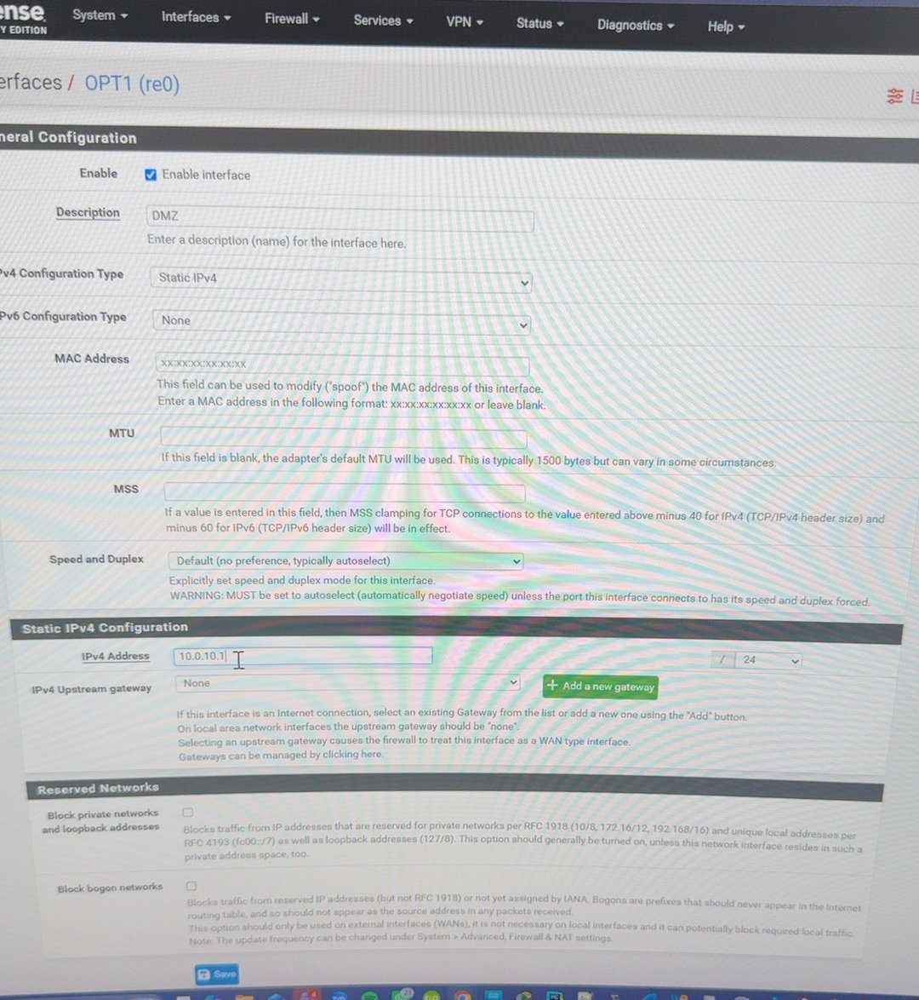
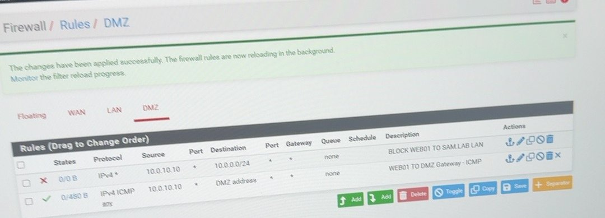
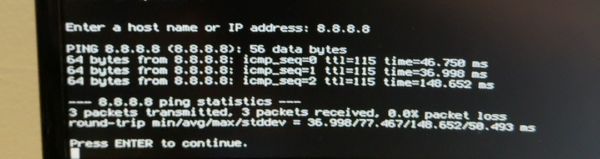

# pfSense Firewall (FW01) — Step by Step

**Goal:** Put a pfSense firewall between the internet and the lab, with a separate DMZ.
**Version:** pfSense CE 2.9.0 · **Hardware:** HP tower, i3-10100, Intel I350-T2 dual NIC + onboard Realtek

| Interface | NIC | Address |
|---|---|---|
| WAN | igb1 | `[CONFIDENTIAL PUBLIC IP]` (ISP IP Passthrough) |
| LAN | igb0 | 10.0.0.1/24 |
| DMZ (OPT1) | re0 | 10.0.10.1/24 |

---

## Step 1 — Make the install USB
1. Download the pfSense CE **AMD64 memstick** installer from Netgate.
2. Write it to a USB drive with **Rufus** or **balenaEtcher**.

## Step 2 — Boot the installer
1. Plug the USB into FW01, open the BIOS boot menu, and select the USB.

> ⚠ **Error:** *Secure Boot Violation — Invalid signature detected.*
> **Fix:** In BIOS, **disable Secure Boot** but keep **UEFI** on. Boot the USB again.



## Step 3 — Install and pick WAN
1. Accept defaults and install to the SSD (ZFS).
2. At **WAN Interface Assignment**, pick the port marked **(active)** → `igb1`.



> 💡 Only the cable plugged into the ISP shows **active**. That's how you know which port is WAN.

## Step 4 — Assign LAN and DMZ ports
1. LAN = `igb0`, OPT1 = `re0`.
2. Later you can confirm under **Interfaces > Interface Assignments**.



## Step 5 — Setup wizard (WebGUI)
1. From a LAN PC, open `https://10.0.0.1` and accept the certificate warning (self-signed — normal).
2. Hostname `FW01`, Domain `sam.lab`, Time zone `America/Chicago`.
3. **Configure LAN Interface:** IP `10.0.0.1`, mask `24`.
4. Change the default admin password (the red warning tells you to).



> ⚠ **Error:** The old home router already used 10.0.0.1, so two gateways fought.
> **Fix:** Put the Netgear RAX36 in **AP mode** at `10.0.0.2` with **DHCP off**. pfSense is now the only gateway.

## Step 6 — Turn off DHCP on pfSense
1. Go to **Services > DHCP Server > LAN**.
2. Uncheck **Enable DHCP server on LAN interface**, then **Save**.

Why: Windows Server DHCP hands out addresses for the domain. Two DHCP servers = conflicts.



## Step 7 — Set up the DMZ
1. Go to **Interfaces > OPT1 (re0)**, check **Enable interface**, Description `DMZ`.
2. IPv4 Configuration Type **Static IPv4**, address `10.0.10.1` / `24`, upstream gateway **None**.
3. **Save > Apply Changes**.



## Step 8 — DMZ firewall rules
1. Go to **Firewall > Rules > DMZ**.
2. Rule 1: **Block**, source `10.0.10.10` (WEB01), destination `10.0.0.0/24` → *BLOCK WEB01 TO SAM.LAB LAN*.
3. Rule 2: **Pass**, ICMP, source `10.0.10.10`, destination **DMZ address** → *WEB01 TO DMZ Gateway - ICMP*.
4. **Save > Apply Changes**.



## Step 9 — WAN public IP
1. On the ISP gateway, turn on **IP Passthrough** to pfSense's WAN MAC.
2. Reboot pfSense. **Status > Interfaces** shows WAN = `[CONFIDENTIAL PUBLIC IP]`.

> ⚠ **Error:** WAN had a private 192.168.1.75 address (double NAT), so VPN from outside could not reach pfSense.
> **Fix:** IP Passthrough gave pfSense the real public IP.

---

## ✅ Check it worked
On the pfSense console: option **7) Ping host** → `8.8.8.8`



On a LAN PC with **Wi-Fi turned off**:
```cmd
ipconfig /all
ping 10.0.0.1
tracert 8.8.8.8
```
- Gateway shows `10.0.0.1`, and `tracert` first hop is `10.0.0.1`.

> ⚠ **Gotcha:** Ping worked even when pfSense was wrong — the PC was using Wi-Fi. Always disable Wi-Fi when testing.

## 📋 Pending (not built yet)
- [ ] Final DMZ → LAN **deny-all** rule set (not only WEB01)
- [ ] LAN/VPN → WEB01 management rule (RDP only from LAN/VPN)
- [ ] WEB01: install IIS and test a sample site
- [ ] WEB01: HTTPS certificate
- [ ] WAN 443 → WEB01 port forward (only if the site goes public)
- [ ] Switch DHCP backend from ISC to **Kea** (ISC is end-of-life)
- [ ] Suricata IDS/IPS on pfSense
- [ ] Firewall aliases and rule naming standard
- [ ] VLANs (802.1Q), Kali test segment
- [ ] LAN move to 10.10.0.0/24
- [ ] pfSense config backup schedule

## Security choices
- No RDP open to the internet.
- DMZ blocked from LAN.
- One DHCP server only.
- Default password changed.
