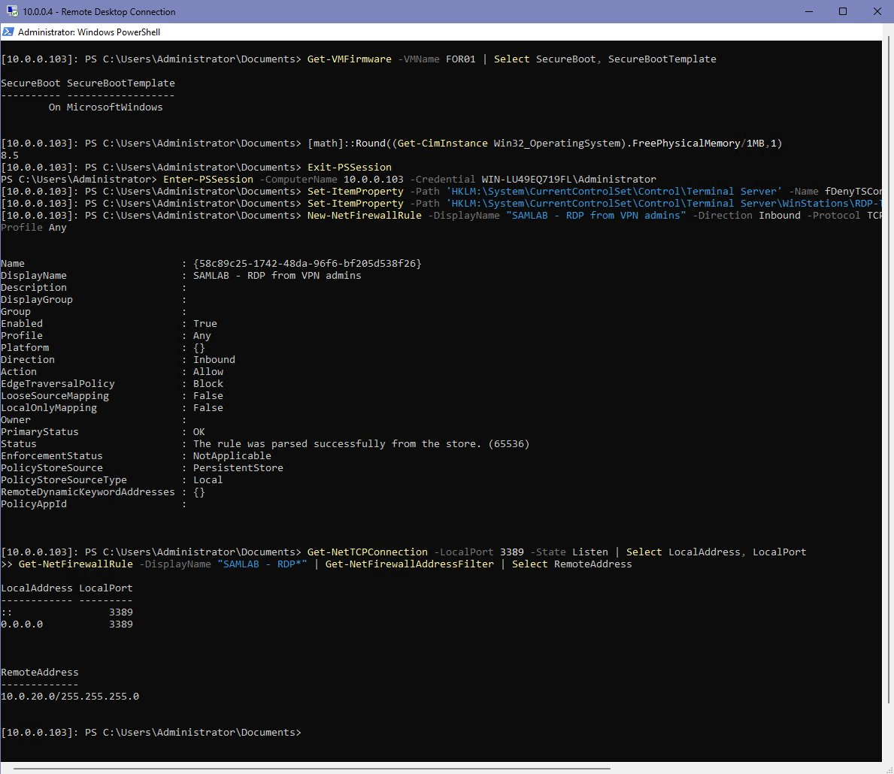

# Remote Desktop over the IPsec VPN — Step by Step

**Goal:** Manage lab servers with Remote Desktop from anywhere, while RDP stays **off the internet**.
**Status:** ✅ Built · **Example target:** DHCP01 (`dhcp.sam.lab`, 10.0.0.20)

```
Admin laptop ──IPsec VPN──► pfSense FW01 ──► dhcp.sam.lab : 3389
gets 10.0.20.x              rule 10.0.20.0/24 → LAN
```

> ⚠ Never forward TCP 3389 on the pfSense WAN. The VPN is the only front door.

---

## Step 1 — Connect the VPN
Connect **SAM-LAB-IPsec** from an outside network — see [IPsec VPN guide](ipsec-vpn.md). The laptop gets `10.0.20.2`.

## Step 2 — Use a domain account in Windows Admin Center
In WAC, select the server > **Manage as** > `SAM\Administrator` > **Use these credentials for all connections**.

> ⚠ **Error:** WAC → *WinRM 0x8009030e — A specified logon session does not exist.*
> **Fix:** WAC was using the local `WAC01\Administrator`. Switch to the domain account. Do **not** set TrustedHosts to `*`.


## Step 3 — Turn on Remote Desktop with NLA
WAC > server > **Settings > Remote Desktop** → **Allow remote connections** + **Network Level Authentication**. Or PowerShell:
```powershell
Set-ItemProperty 'HKLM:\System\CurrentControlSet\Control\Terminal Server' -Name fDenyTSConnections -Value 0
Set-ItemProperty 'HKLM:\System\CurrentControlSet\Control\Terminal Server\WinStations\RDP-Tcp' -Name UserAuthentication -Value 1
```

## Step 4 — Limit RDP to the LAN and VPN pool
The built-in rules allow **Any** address. Lock them down:
```powershell
Get-NetFirewallRule -DisplayGroup 'Remote Desktop' | Get-NetFirewallAddressFilter | Select RemoteAddress
Set-NetFirewallRule -DisplayGroup 'Remote Desktop' -RemoteAddress 10.0.0.0/24,10.0.20.0/24
```

## Step 5 — Test and connect
```powershell
Test-NetConnection dhcp.sam.lab -Port 3389
mstsc /v:dhcp.sam.lab
```
`TcpTestSucceeded : True` on interface **SAM-LAB-IPsec**, source `10.0.20.2`. The certificate warning is expected (self-signed) — check the name matches, then **Yes**.

## Same idea on the Hyper-V host
The host is a workgroup machine, so it gets a custom rule that only allows the VPN pool:
```powershell
New-NetFirewallRule -DisplayName "SAMLAB - RDP from VPN admins" -Direction Inbound `
  -Protocol TCP -LocalPort 3389 -RemoteAddress 10.0.20.0/24 -Action Allow -Profile Any
```



---

## ✅ Check it worked
| Where | Command | Good result |
|---|---|---|
| Server | `Get-NetFirewallRule -DisplayGroup 'Remote Desktop' \| Get-NetFirewallAddressFilter` | 10.0.0.0/24, 10.0.20.0/24 |
| Laptop (VPN on) | `Test-NetConnection dhcp.sam.lab -Port 3389` | True |
| Laptop (VPN off, outside) | same | **Fails** (negative test) |

Browser-based RDP is also available through [Guacamole](../04-servers/guacamole.md).

## 📋 Pending (not built yet)
- [ ] Negative test: confirm RDP fails with the VPN off
- [ ] Push RDP + NLA + firewall scope with a **GPO on the Servers OU** instead of by hand
- [ ] Named admin account (`adm-sam`) instead of the built-in Administrator
- [ ] Trusted RDP certificates from AD CS
- [ ] Audit RDP logons (events 4624 type 10 / 4625) into the SIEM
- [ ] Update address ranges after LAN move to 10.10.0.0/24
