# DC01 — Active Directory Domain Controller — Step by Step

**Goal:** A domain `sam.lab` with DNS, organized OUs, role-based groups, and domain-joined clients.
**Status:** ✅ Built
**Server:** DC01 · Windows Server 2022 (Hyper-V Gen 2, 4 GB) · IP 10.0.0.4 · NetBIOS `SAM`

---

## Step 1 — Static IP and DNS
1. IP `10.0.0.4/24`, gateway `10.0.0.1`.
2. DNS = `127.0.0.1` (itself) — a DC must point to itself, not to the router.
3. Rename the server `DC01`, restart.

## Step 2 — Install AD DS and promote
```powershell
Install-WindowsFeature AD-Domain-Services -IncludeManagementTools
Install-ADDSForest -DomainName "sam.lab" -DomainNetbiosName "SAM" -InstallDns
```
The server restarts as the first domain controller.

## Step 3 — Check DC health
```cmd
ipconfig /all
dcdiag /test:dns
nltest /dsgetdc:sam.lab
```

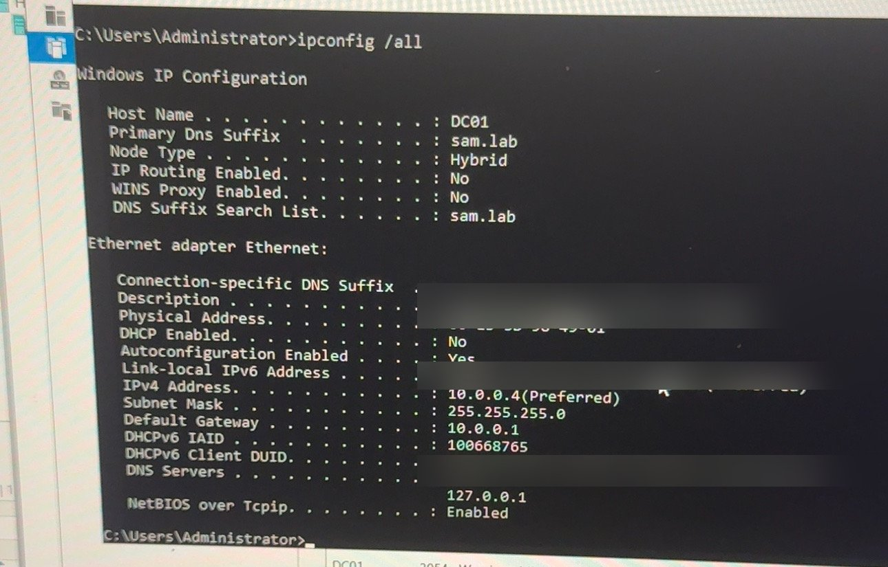

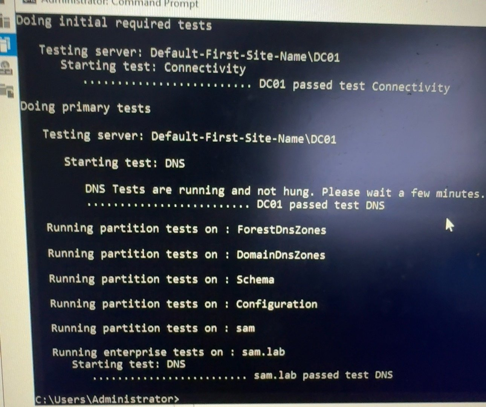

## Step 4 — Build the OU structure
Right-click `sam.lab` > **New > Organizational Unit** (keep **Protect from accidental deletion** checked).

```
sam.lab
└── SAMLAB
    ├── Computers (Laptops)
    ├── Groups
    ├── Servers
    ├── Service Accounts
    └── Users
        ├── General User
        ├── IT
        ├── HR
        ├── Finance
        └── Operations
```

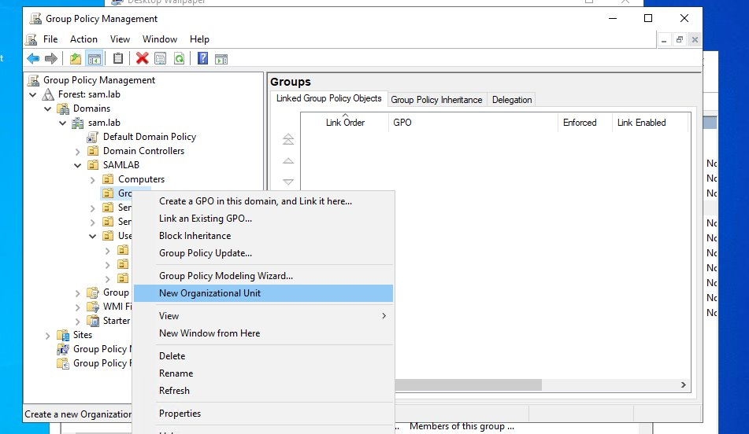

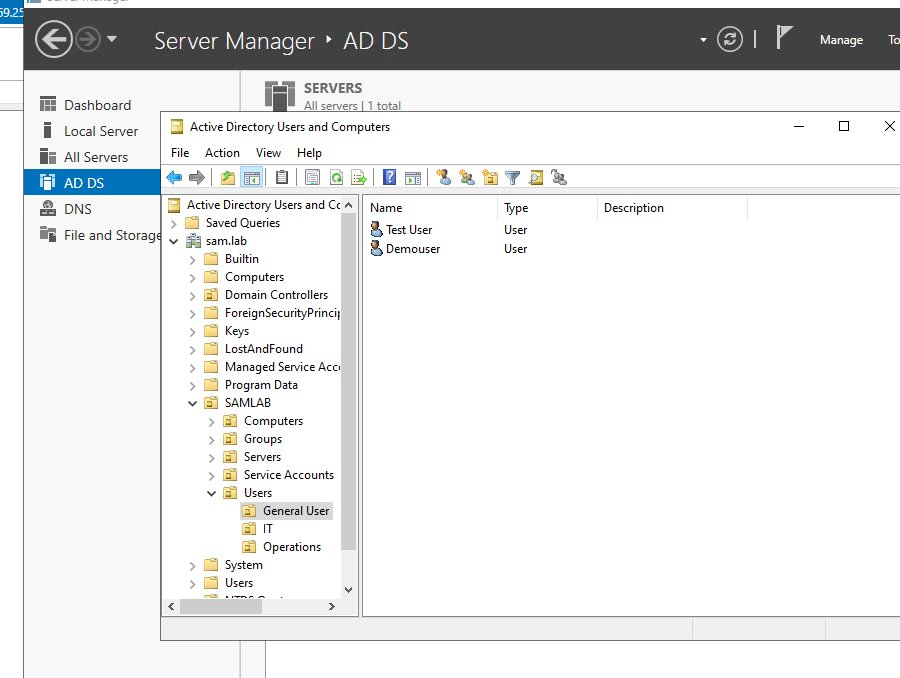

Why: OUs let you link different GPOs to different people and computers. Keeping everything under one `SAMLAB` OU keeps it apart from the built-in containers.

## Step 5 — Create role-based groups
In **SAMLAB > Groups**: **New > Group**, scope **Global**, type **Security**.

| Group | Who | Rights |
|---|---|---|
| GG_General_Users | Normal staff | Use only, locked down |
| GG_Operations | Support staff | Limited installs |
| GG_IT_Users | IT admins | Admin |

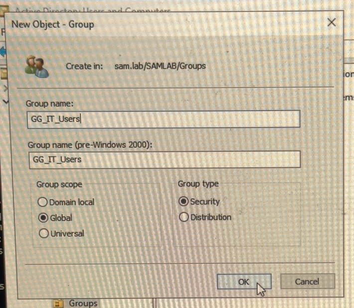

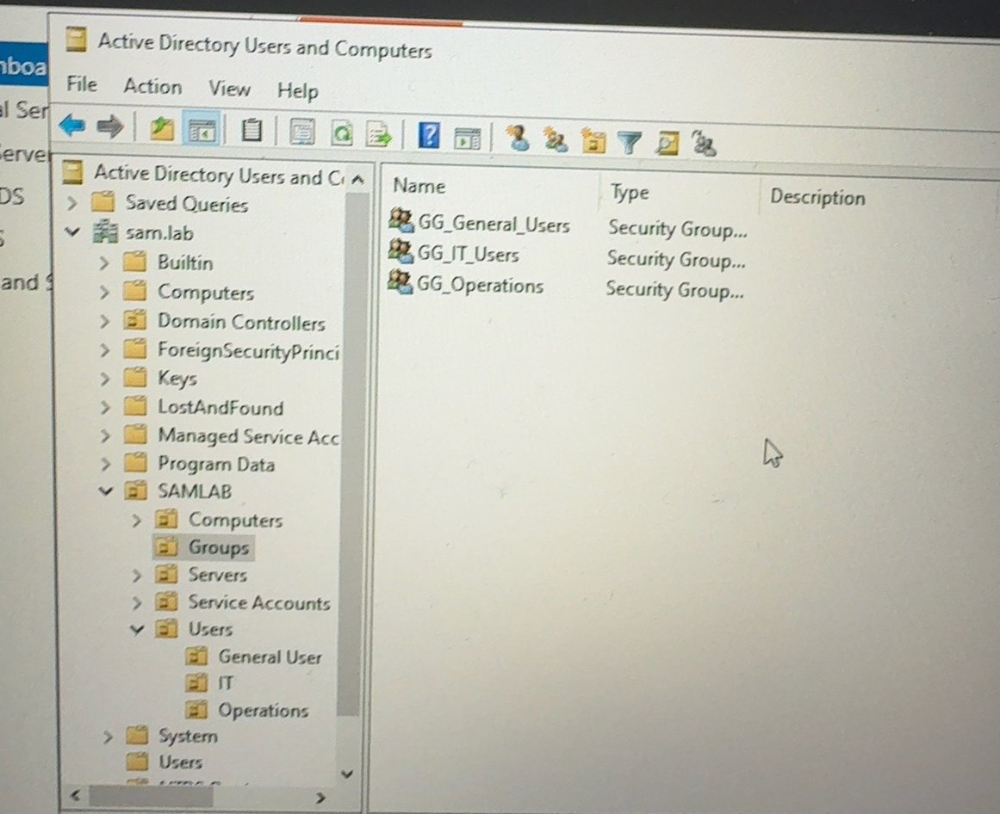

## Step 6 — Create users and add to groups
1. In **Users > General User**, **New > User** (example: `Test User`, `Demouser`).
2. User **Properties > Member Of > Add** → `GG_General_Users`.

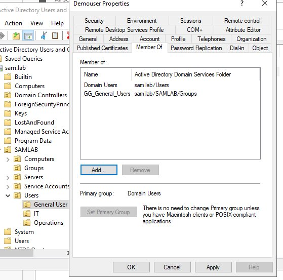

## Step 7 — Join a client to the domain (DEMO01)
1. On the client, set DNS to `10.0.0.4` (the DC), not the router.

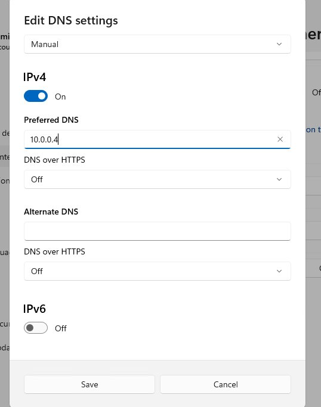

2. **System > About > Domain or workgroup > Change** → Domain `sam.lab` → enter a domain admin → restart.

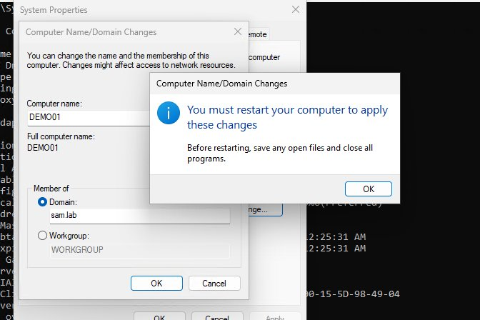

> ⚠ **Error:** *"The specified username is invalid."*
> **Fix:** Type the account as `SAM\Administrator` (or `administrator@sam.lab`), not just `Administrator`.

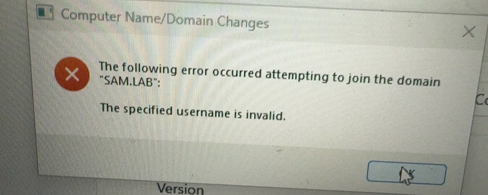

> ⚠ **Error:** *"An Active Directory Domain Controller for the domain sam.lab could not be contacted."*
> **Fix:** Client DNS was the router. Point DNS to `10.0.0.4`, then `ipconfig /flushdns`.

> ⚠ **Error (ADUC from laptop):** *"Naming information cannot be located."*
> **Fix:** Same cause — the admin laptop must use `10.0.0.4` as DNS.

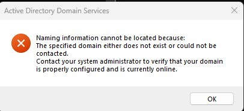

## Step 8 — Allow RDP for a standard user
On DEMO01: add `SAM\Demouser` to the local **Remote Desktop Users** group (as a domain admin).

> ⚠ **Error:** *"The connection was denied because the user account is not authorized for remote login."*
> **Fix:** User was not in **Remote Desktop Users** on the target PC.

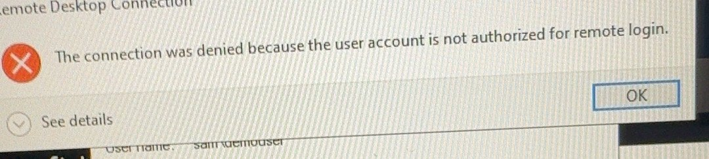

---

## ✅ Check it worked
On a domain client:
```cmd
whoami
nltest /dsgetdc:sam.lab
nslookup -type=SRV _ldap._tcp.dc._msdcs.sam.lab
```
`whoami` shows `sam\username`, and DC01 / 10.0.0.4 is found.

## 📋 Pending (not built yet)
- [ ] Second DC (or RODC) for redundancy
- [ ] Separate admin accounts (`adm-sam`) — don't use daily accounts as admin
- [ ] Windows LAPS for local admin passwords
- [ ] Reverse DNS zone + DNS scavenging
- [ ] 50-policy security baseline (password, lockout, auditing — see GPO guide)
- [ ] AD backup (System State) and restore test
- [ ] Join CLIENT02, CLIENT03, CLIENT04
- [ ] Remove TrustedHosts entry (10.0.0.103) left on DC01 from host work
- [ ] Move Admins into a tiered OU (Tier 0/1/2)
