# Group Policy (GPO) — Step by Step

**Goal:** Lock down standard users and push a company wallpaper, managed from DC01.

| GPO | Linked to | Status |
|---|---|---|
| GPO-General-User-Restrictions | SAMLAB > Users > General User | ✅ Working |
| GG_wallpaper1 (wallpaper) | SAMLAB > Users | 🔴 Not applying — see Pending |

---

## Part A — Restrict standard users

### Step 1 — Create and link the GPO
1. **Group Policy Management** > right-click **General User** OU > **Create a GPO in this domain, and Link it here**.
2. Name `GPO-General-User-Restrictions`.

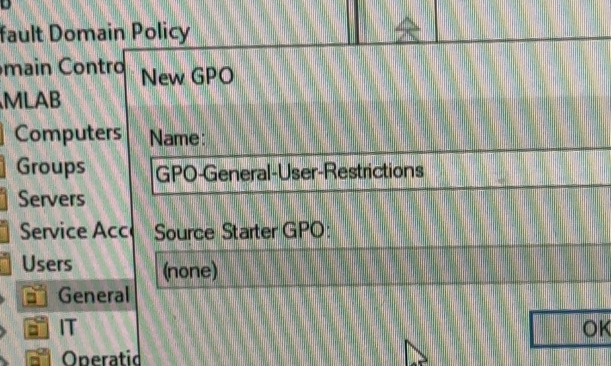

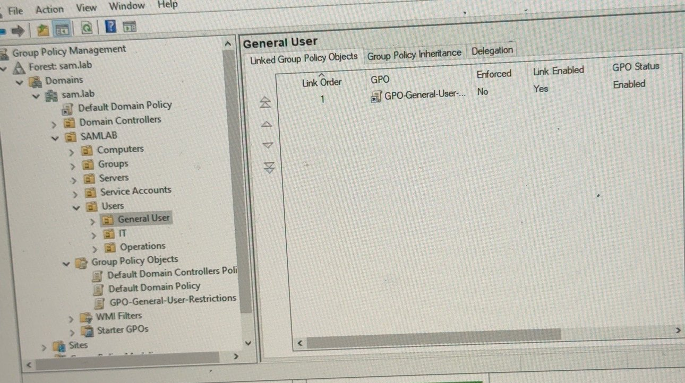

### Step 2 — Settings (User Configuration > Policies > Administrative Templates)
| Path | Setting | Value |
|---|---|---|
| System | Prevent access to the command prompt | Enabled |
| System | Prevent access to registry editing tools | Enabled |
| Control Panel | Prohibit access to Control Panel and PC settings | Enabled |
| System > Ctrl+Alt+Del Options | Remove Task Manager / Lock / Logoff / Change Password | Enabled |

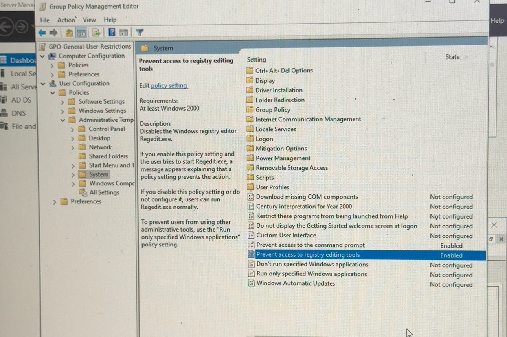

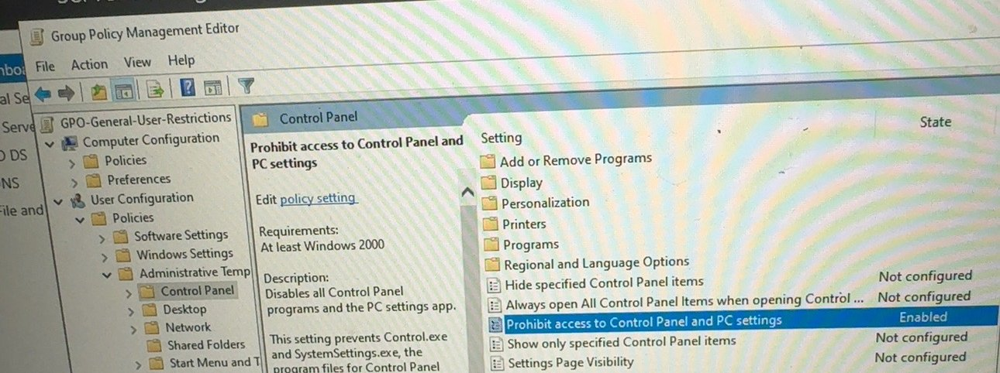

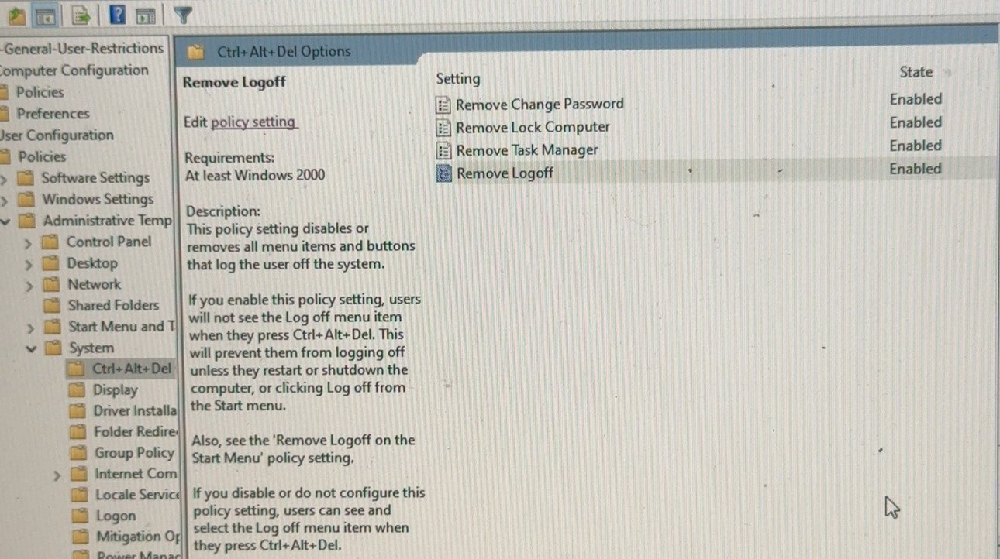

### Step 3 — Test on a client
Sign in as a General User, then:
```powershell
gpupdate /force
whoami
gpresult /r
```

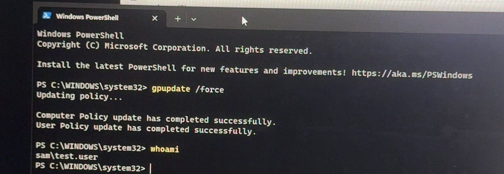

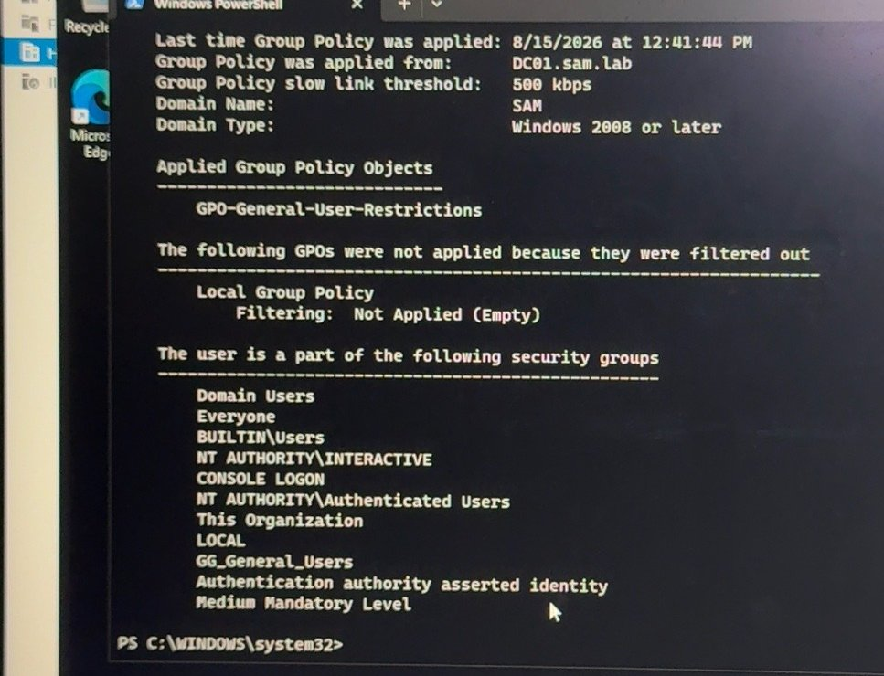

Open **cmd** → *"The command prompt has been disabled by your administrator."* ✅

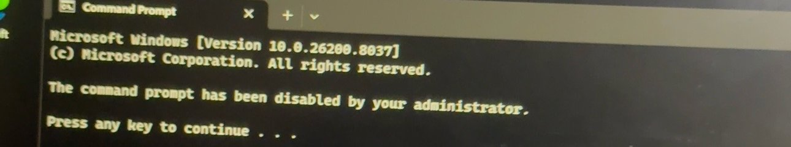

---

## Part B — Company wallpaper

### Step 1 — Share the wallpaper
1. On DC01 create `C:\SAMLAB\Wallpapers`, put `SAMLAB.png` in it.
2. **Properties > Sharing > Advanced Sharing** → share name `Wallpapers`.
3. **Permissions**: Everyone = **Read** only. NTFS: Users = Read.

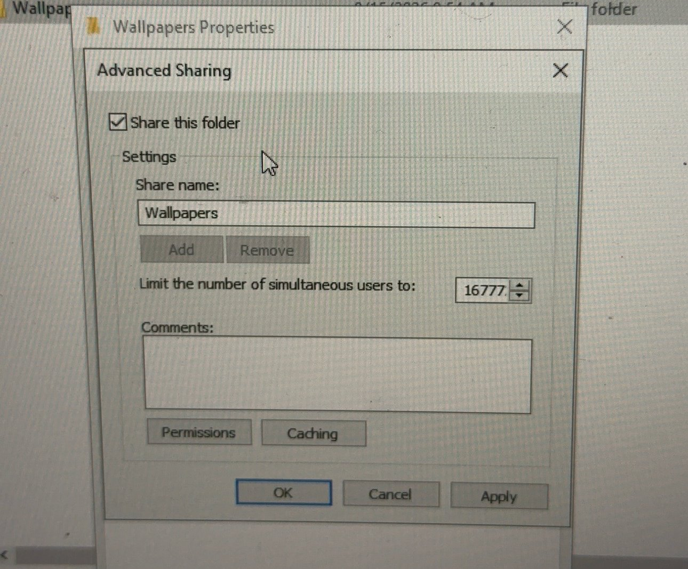

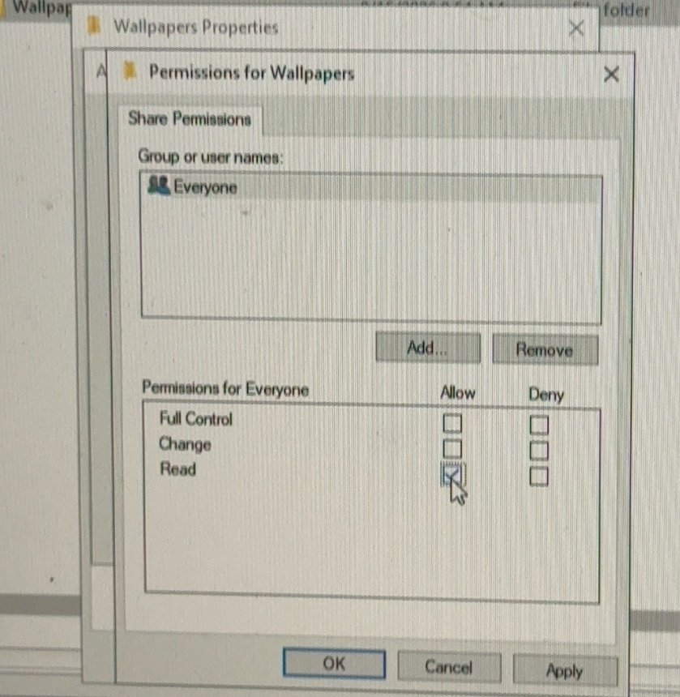

Check from a client: open `\\dc01\Wallpapers`.

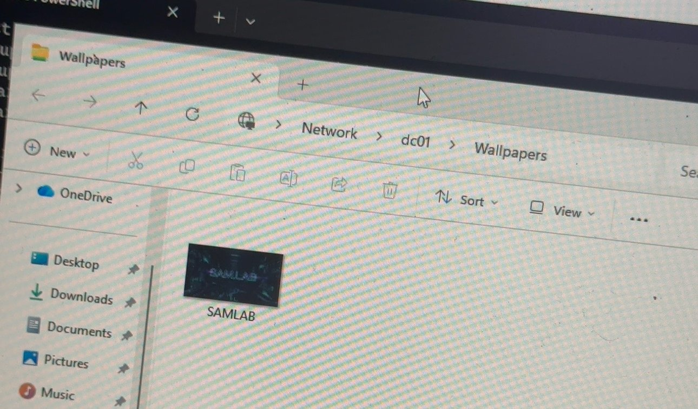

### Step 2 — Wallpaper GPO
1. User Configuration > Policies > Administrative Templates > Desktop > Desktop > **Desktop Wallpaper** = Enabled.
2. Wallpaper name `\\DC01\Wallpapers\SAMLAB.png`, style **Fill**.
3. Also enable **Prevent changing desktop background** (Control Panel > Personalization).

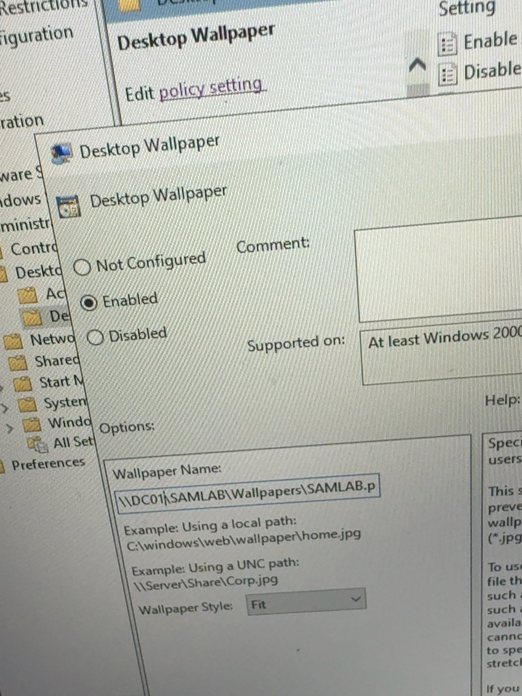

### Step 3 — Target one group (GG_wallpaper1)
1. Add user `samlab01` to group `GG_wallpaper1`.
2. GPO **Delegation / Security Filtering** set to `GG_wallpaper1`.

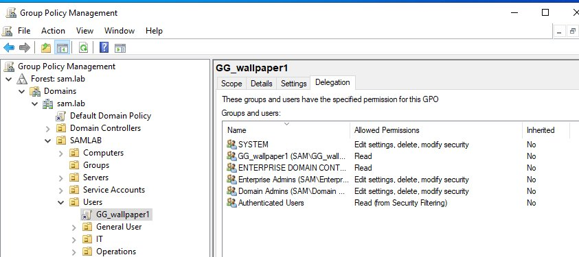

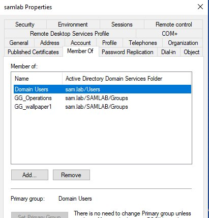

> ⚠ **Error:** GPMC — *"No mapping between account names and security IDs was done."*
> **Fix:** The group name was typed wrong or not created yet. Create the group first, then add it with **Check Names**.

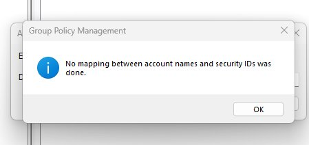

> ⚠ **Error (still open):** `gpresult /r` as samlab01 → **GG_wallpaper1 — Filtering: Denied (Security)**.

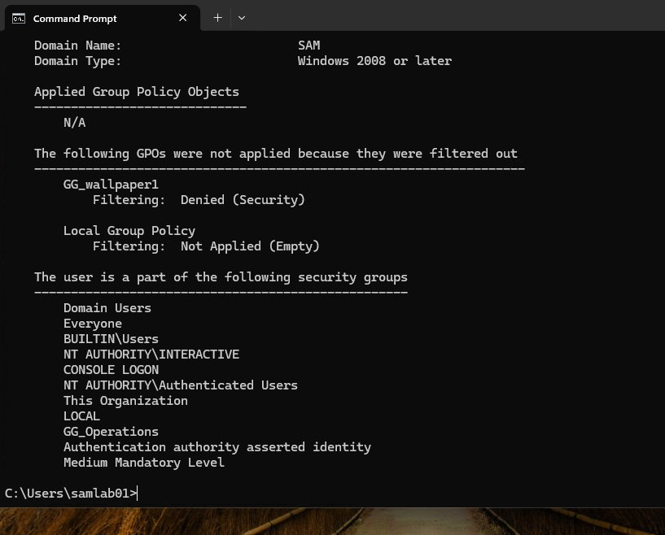

**Look closely:** the user's group list does **not** show `GG_wallpaper1`. Two likely causes:
1. The user's sign-in token is old. Group changes only apply after **sign out / sign in** (or a restart).
2. Since Microsoft update MS16-072, the **computer** account must be able to read the GPO. Removing **Authenticated Users** from Security Filtering breaks this. Fix: keep `GG_wallpaper1` in **Security Filtering** (Read + Apply), and on the **Delegation** tab add **Domain Computers** with **Read**.

Then sign out/in as samlab01 and run `gpresult /r` again.

---

## 📋 Pending (not built yet)
- [ ] Fix GG_wallpaper1 filtering (sign out/in + Domain Computers Read) and confirm with `gpresult /h report.html`
- [ ] Decide one wallpaper GPO name (`GPO-SAMLAB-Wallpaper` vs `SAMLAB Rule` vs `GG_wallpaper1`) and remove duplicates
- [ ] Password policy: 14 chars, complexity, history 24
- [ ] Account lockout: 5 attempts, 15 min
- [ ] Screen lock after 15 min, logon banner
- [ ] BitLocker GPO
- [ ] USB / removable storage block
- [ ] Advanced audit policy + PowerShell logging (for SIEM)
- [ ] Windows Firewall + Defender GPOs
- [ ] Windows LAPS GPO
- [ ] AppLocker (audit first)
