# DEPLOYWIN — WDS / PXE Network Install — Step by Step

**Goal:** Boot a PC from the network and install Windows without a USB stick.
**Server:** DEPLOYWIN · Windows Server 2022 (Hyper-V Gen 2, 4 GB) · IP 10.0.0.15 · joined to `sam.lab`
**Status:** 🟠 In progress — WDS answers PXE, but the client stops with a BCD error.

---

## Step 1 — Static IP
IP `10.0.0.15/24`, gateway `10.0.0.1`, DNS `10.0.0.4`.

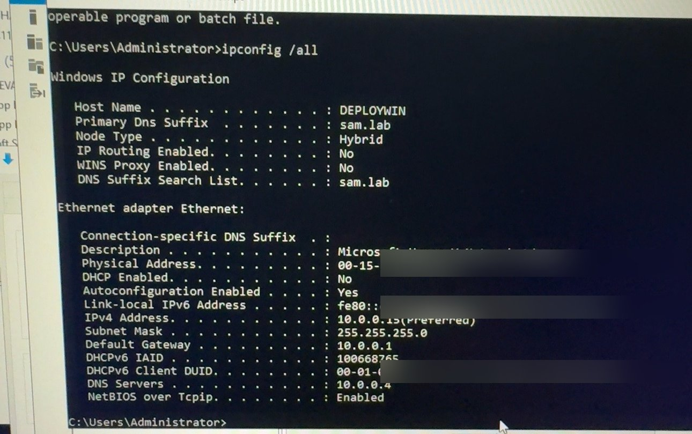

> ⚠ **Error:** `ipconfig` showed **10.0.0.10 (Duplicate)** and a 169.254.x.x address.
> **Fix:** Another device already had 10.0.0.10. Picked a free IP (10.0.0.15) outside the DHCP range.

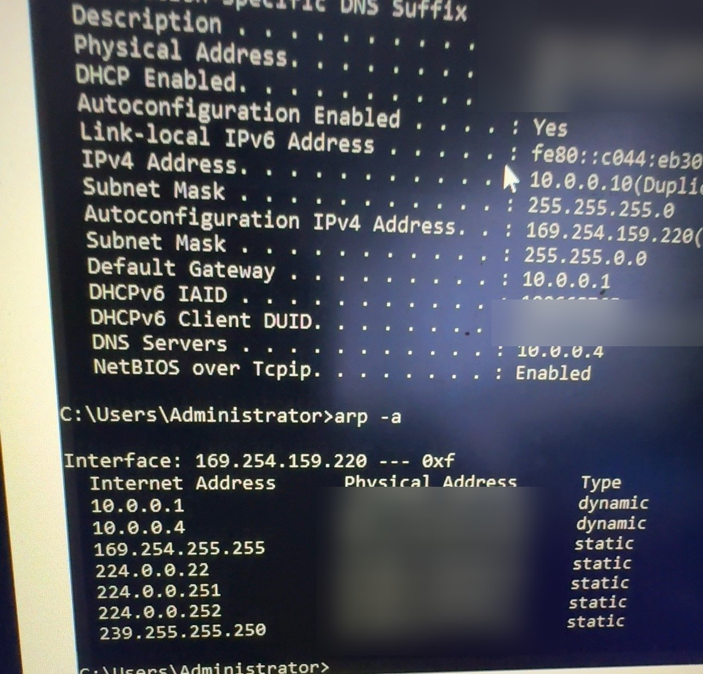

## Step 2 — Join the domain
> ⚠ **Error:** `nltest /dsgetdc:sam.lab` → **1355 ERROR_NO_SUCH_DOMAIN**, even though `nslookup dc01.sam.lab` worked.

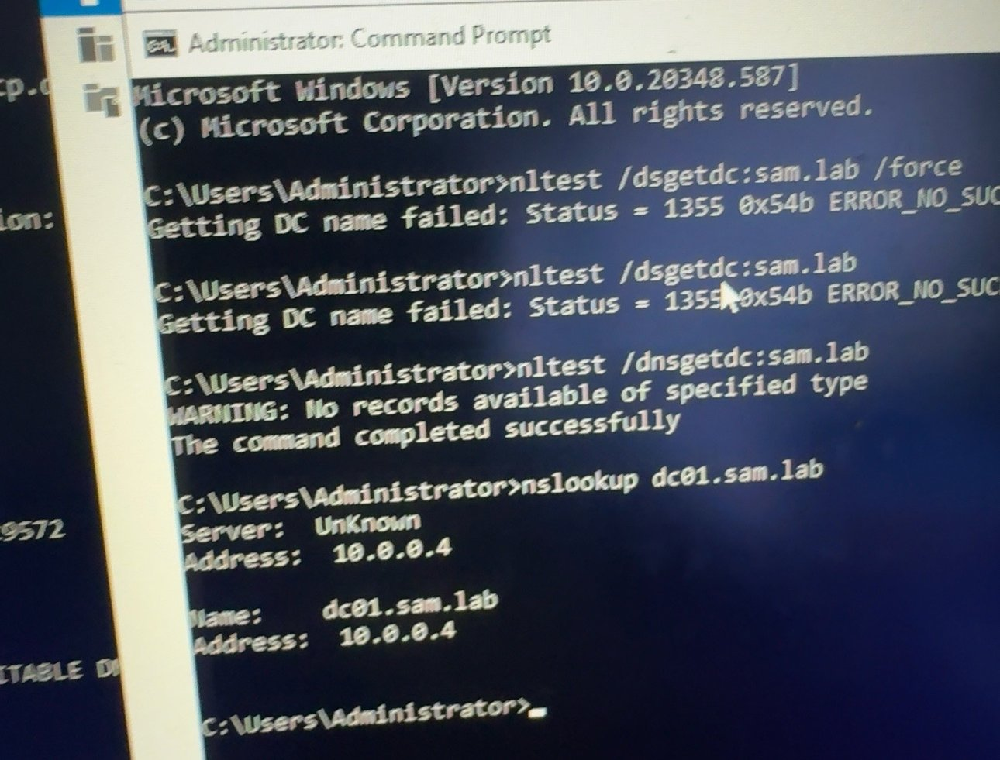

**Fix:** The Netlogon service was stopped.
```cmd
net start netlogon
nslookup -type=srv _ldap._tcp.dc._msdcs.sam.lab
nltest /dsgetdc:sam.lab
```

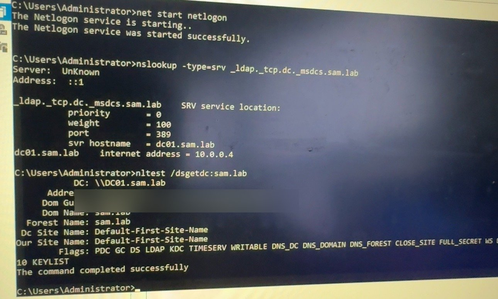

Then join `sam.lab` and restart. Check:
```cmd
whoami
nltest /sc_verify:sam.lab
```

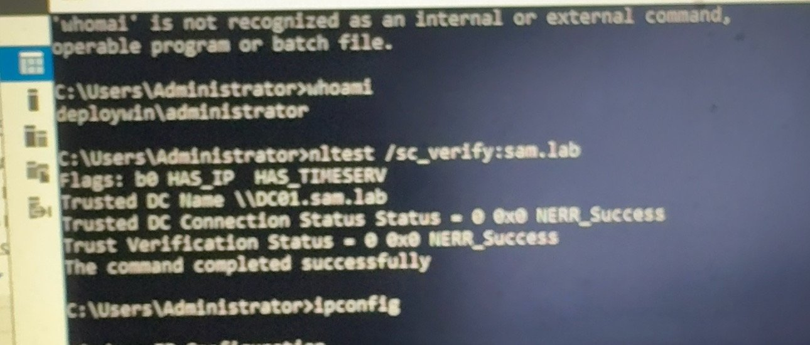

## Step 3 — Install WDS
```powershell
Install-WindowsFeature WDS -IncludeManagementTools
```
(Deployment Server + Transport Server)

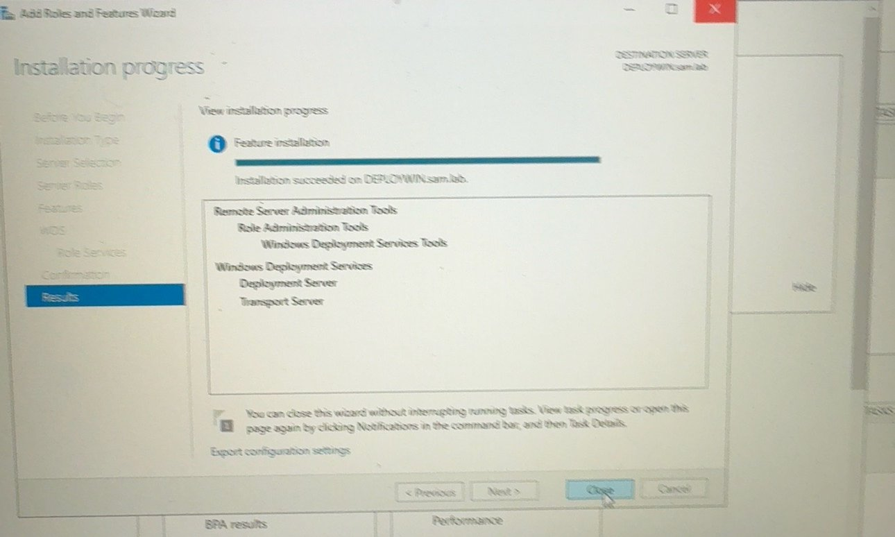

## Step 4 — Configure WDS
1. **Windows Deployment Services** > right-click server > **Configure Server**.
2. **Integrated with Active Directory**.
3. Remote installation folder `C:\RemoteInstall`.

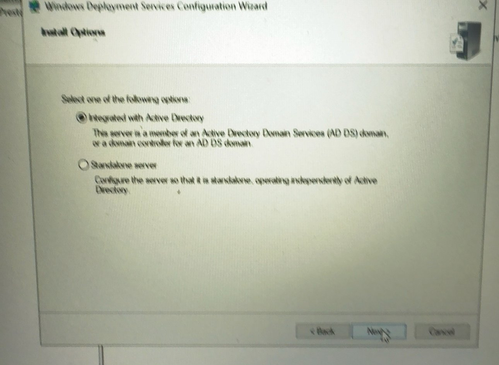

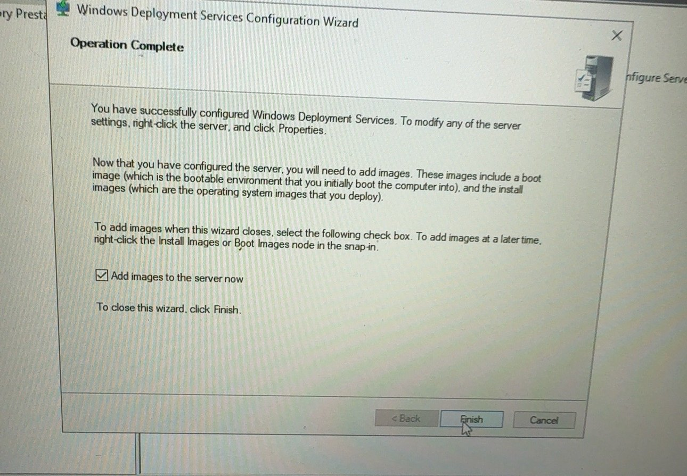

## Step 5 — PXE response and DHCP tab
1. Server **Properties > PXE Response** → **Respond to all client computers (known and unknown)**, delay `0`.
2. **DHCP** tab → leave both boxes **unchecked** (DHCP runs on a different server).

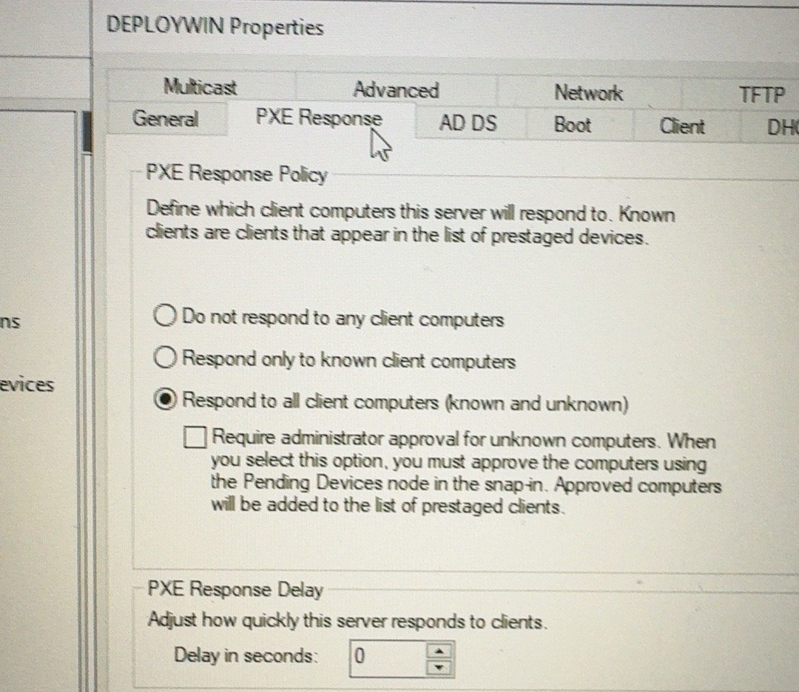

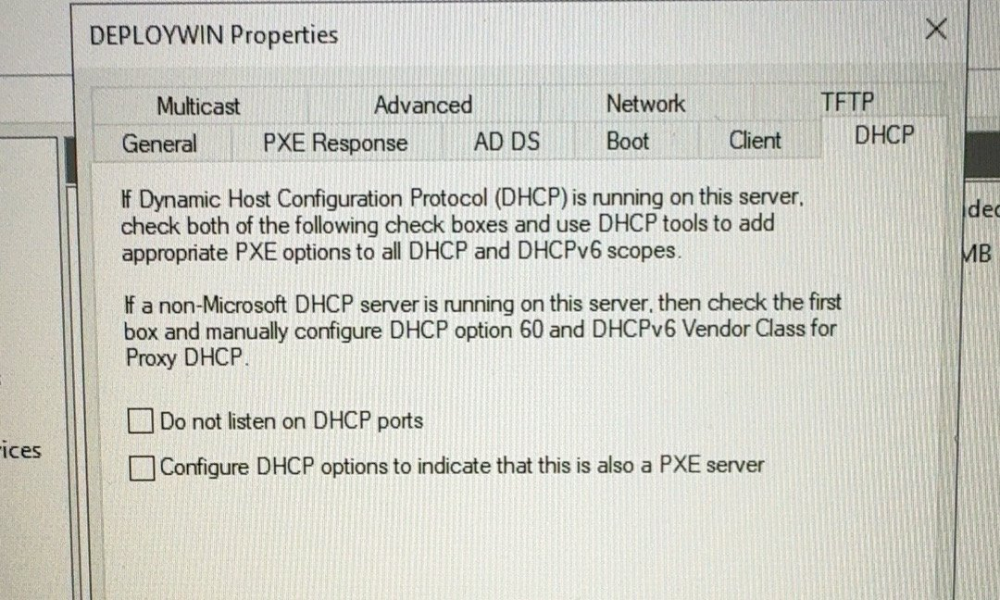

## Step 6 — Add boot image
**Boot Images > Add Boot Image** → `sources\boot.wim` from the Windows ISO.

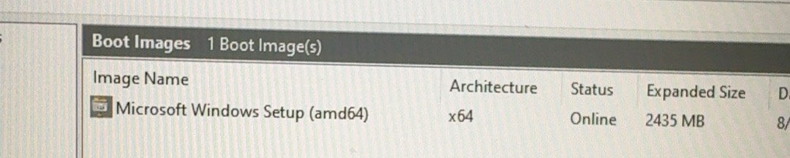

## ✅ Check WDS is ready
```powershell
Get-Service wdsserver
netstat -ano -p udp | findstr ":67 :69 :4011"
wdsutil /get-server /show:config
```

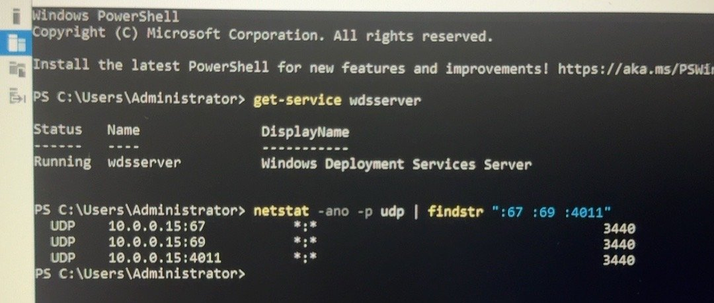

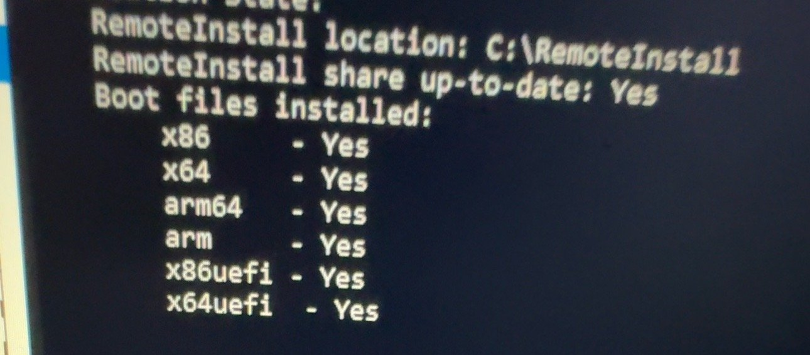

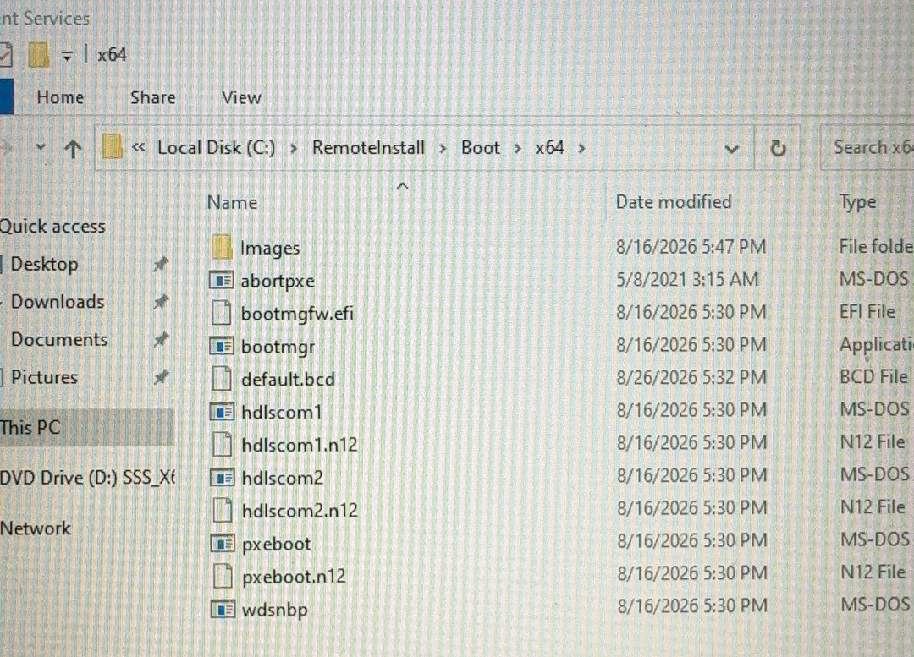

Client: boot from network → **Start PXE over IPv4**.


---

## 🔴 Open problem — BCD 0xc000000f
Client reaches **Windows Boot Manager (Server IP: 10.0.0.15)**, then: *File: \Boot\BCD — Status 0xc000000f*.

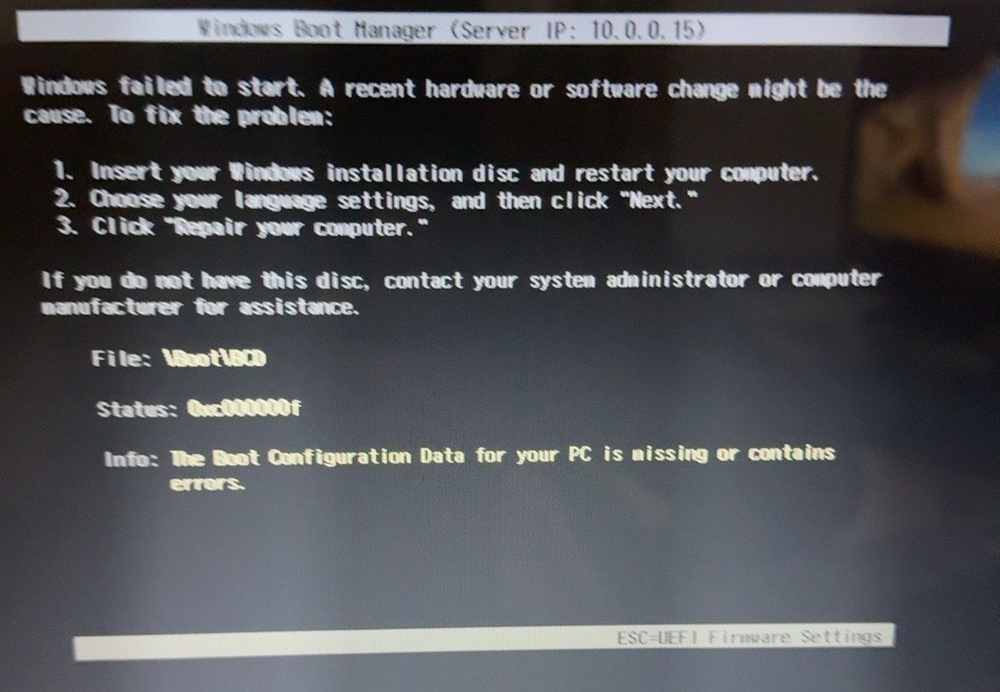

Things to try next (one at a time):
1. Remove DHCP options **066/067** and let WDS answer PXE directly (same subnet).
2. Rebuild the BCD:
```cmd
wdsutil /set-server /BcdRefreshPolicy /Enabled:Yes /RefreshPeriod:1
```
3. Remove and re-add the boot image, then restart WDS.
4. Set TFTP **Maximum block size** to `1456` and turn off variable window extension (WDS > Properties > TFTP).

> ℹ **Note:** Microsoft has retired **MDT** (no updates or fixes). Plan to use WDS + Configuration Manager (SCCM) or Autopilot instead.

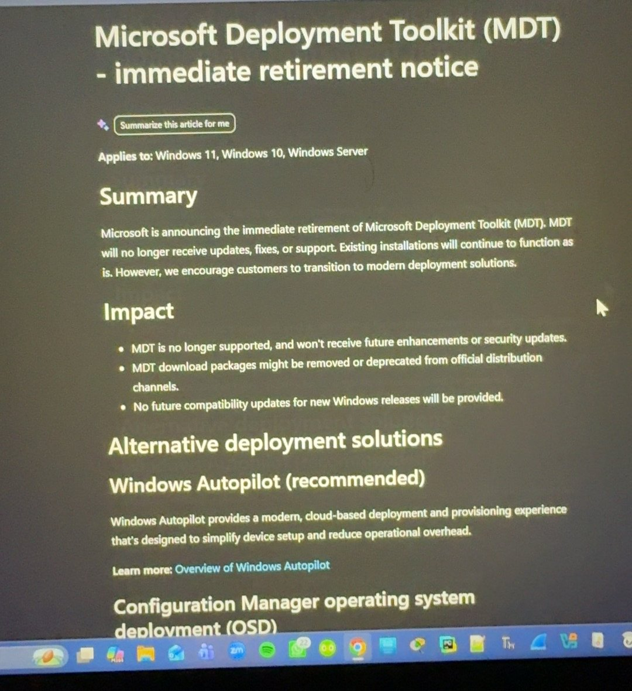

## 📋 Pending (not built yet)
- [ ] Fix BCD 0xc000000f and boot WinPE on a physical client
- [ ] Add install image (Windows 11 25H2) and deploy one PC end-to-end
- [ ] Unattend file: auto domain join to `sam.lab`, correct OU
- [ ] Re-enable Windows Firewall on DEPLOYWIN with WDS rules
- [ ] CM01 — Configuration Manager (SCCM) for OSD, apps, patching
- [ ] Driver packages for lab hardware
