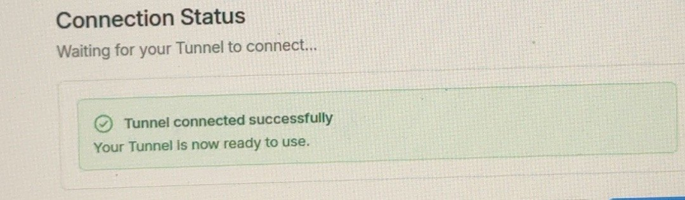
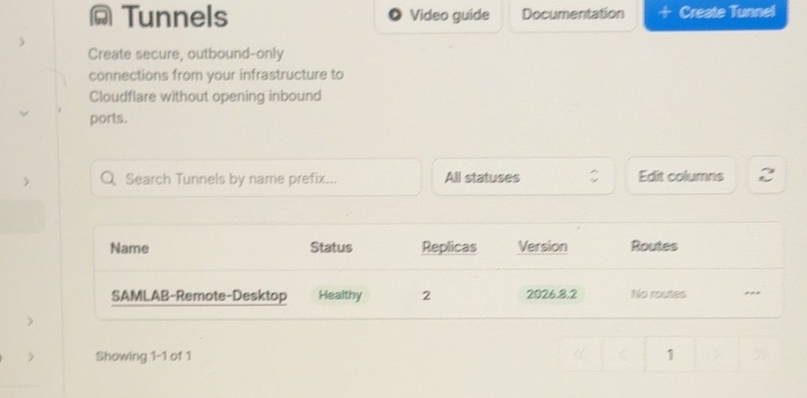
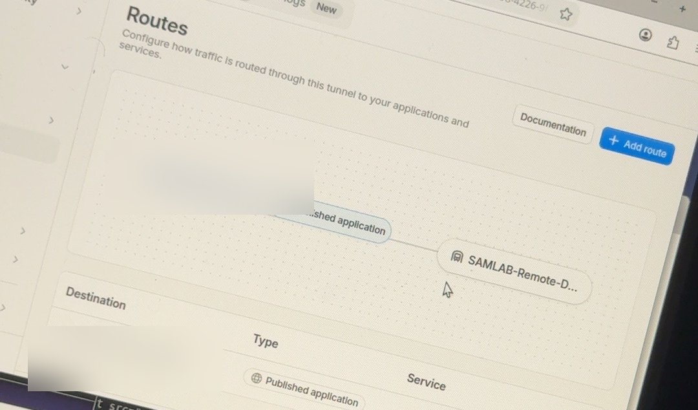
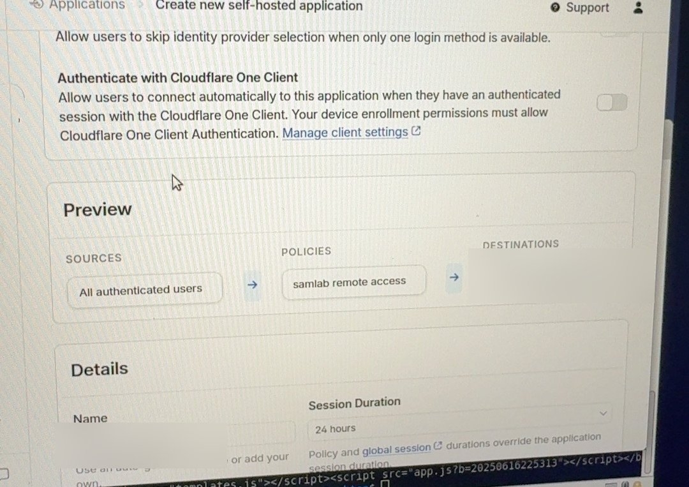

# Cloudflare Tunnel + Access — Step by Step

**Goal:** Reach Guacamole (browser-based remote desktop) from anywhere, **without opening any port** on the firewall.
**Tunnel:** `SAMLAB-Remote-Desktop` · runs `cloudflared` on GUAC01 · route `[CONFIDENTIAL REMOTE HOSTNAME]` → `http://localhost:8080`

How it works: `cloudflared` on GUAC01 makes an **outbound** connection to Cloudflare. Visitors hit Cloudflare first, must pass **Cloudflare Access** login, then traffic comes down the tunnel. Nothing is exposed on pfSense WAN.

---

## Step 1 — Move DNS to Cloudflare
1. Add the domain to a free Cloudflare account.
2. At the registrar, change nameservers to the two Cloudflare nameservers.

## Step 2 — Create the tunnel
1. **Zero Trust > Networks > Tunnels > Create a tunnel** → type **Cloudflared**, name `SAMLAB-Remote-Desktop`.
2. Pick **Debian/Ubuntu**, copy the install command, run it on GUAC01:
```bash
sudo cloudflared service install [TOKEN - CONFIDENTIAL]
```
3. Wait for **Tunnel connected successfully**.





## Step 3 — Publish the app
**Routes > Add route > Published application**: hostname `[CONFIDENTIAL REMOTE HOSTNAME]`, service `http://localhost:8080`.



## Step 4 — Protect it with Cloudflare Access
1. **Access > Applications > Add > Self-hosted**, domain `[CONFIDENTIAL REMOTE HOSTNAME]`.
2. Policy `samlab remote access` → **Allow** only your email(s).
3. Session duration **24 hours**.



---

## ✅ Check it worked
1. From a phone on cellular, open `https://[CONFIDENTIAL REMOTE HOSTNAME]/guacamole`.
2. You see the Cloudflare login first, then Guacamole.
3. On GUAC01:
```bash
systemctl status cloudflared
```

## 📋 Pending (not built yet)
- [ ] Access policy: email allow-list + MFA (One-time PIN or IdP)
- [ ] Only allow your country, block others
- [ ] Turn on Access audit logs, review weekly
- [ ] Remove Tailscale now that Tunnel + IPsec work
- [ ] Back up the tunnel token in a password manager (never in Git)
