# GUAC01 — Apache Guacamole (Remote Desktop in a Browser) — Step by Step

**Goal:** Open an RDP session to lab PCs from any web browser.
**Server:** GUAC01 (`guca01`) · Ubuntu 26.04 LTS · Hyper-V Gen 2, 2 vCPU, 2 GB · IP 10.0.0.11
**Stack:** guacd 1.6.0 (built from source) · Tomcat 10 · MariaDB 11.8 · guacamole-auth-jdbc-mysql 1.6.0

---

## Step 1 — Install Ubuntu and check the network
1. New Hyper-V VM (Gen 2, `LAB-LAN-EX`), install Ubuntu Server/Desktop, user `samadmin`.

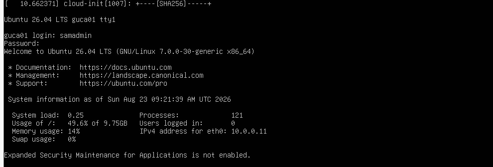

2. Check IP and reach the DC and gateway:
```bash
ip addr
ping -c 4 10.0.0.4
ping -c 4 10.0.0.1
```

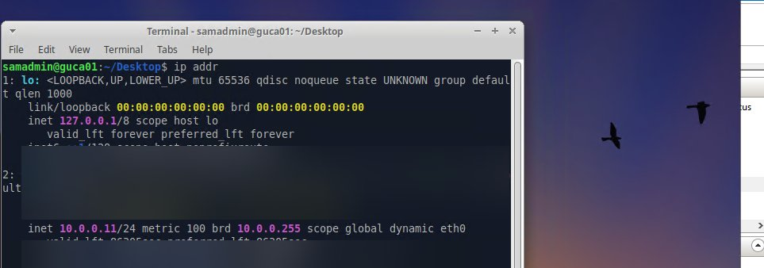

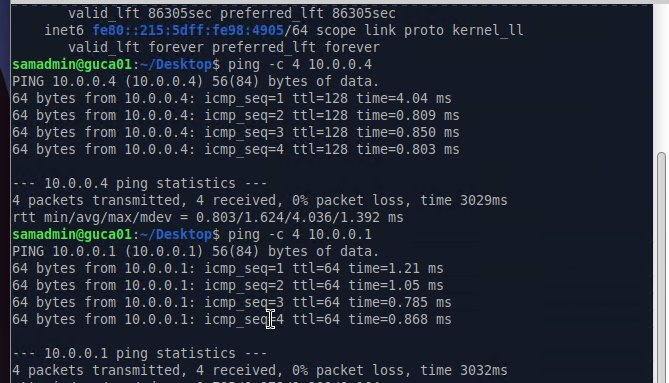

## Step 2 — Fix the disk size
> ⚠ **Error:** `apt install` failed — *"More space needed than available"*. `df -h` showed `/` at **100%** of 9.8 GB.

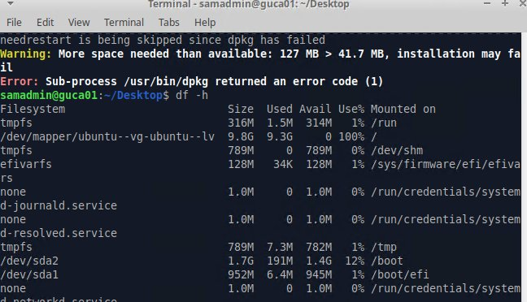

**Fix:** The Ubuntu installer only gave the root volume 10 GB of the disk. Grow it to use all free space:
```bash
sudo growpart /dev/sda 3
sudo pvresize /dev/sda3
sudo lvextend -l +100%FREE -r /dev/ubuntu-vg/ubuntu-lv
df -h
```

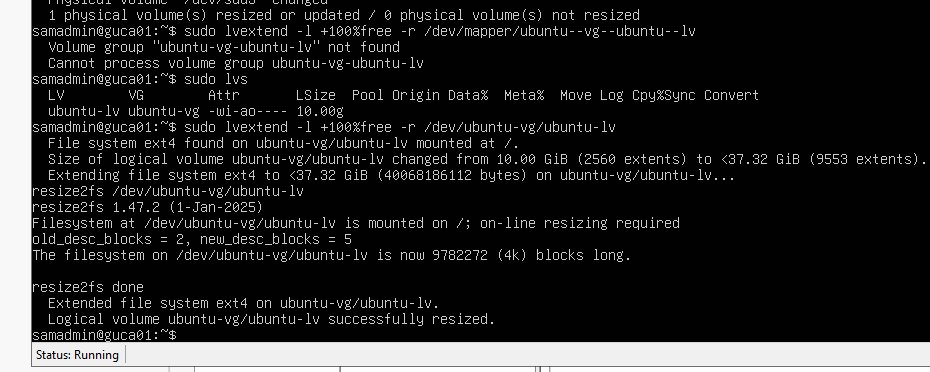

## Step 3 — Build guacamole-server (guacd) 1.6.0
```bash
sudo apt install -y build-essential autoconf libtool libcairo2-dev libjpeg-turbo8-dev \
  libpng-dev libtool-bin uuid-dev libfreerdp-dev libssh2-1-dev libpango1.0-dev \
  libvncserver-dev libwebsockets-dev libssl-dev libvorbis-dev libwebp-dev libpulse-dev
```

> ⚠ **Error:** Release tarball build failed — `'_XOPEN_SOURCE' redefined [-Werror]` and FreeRDP 3 `pVerifyCertificate is deprecated [-Werror=deprecated-declarations]`.

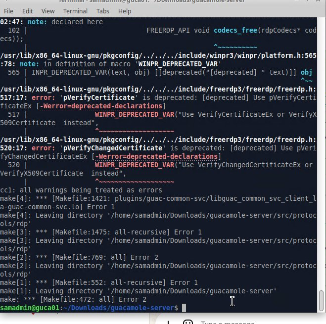

**Fix:** Build from the current Git source, which supports FreeRDP 3:
```bash
cd ~/Downloads
git clone https://github.com/apache/guacamole-server.git
cd guacamole-server
autoreconf -fi
./configure --with-systemd-dir=/etc/systemd/system
make
sudo make install
sudo ldconfig
sudo systemctl enable --now guacd
```

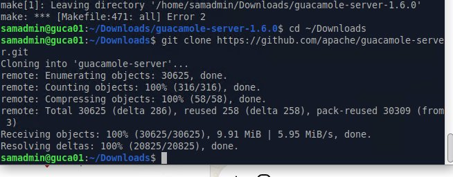

Check: `systemctl status guacd` → **active (running)**, listening on 127.0.0.1:4822.

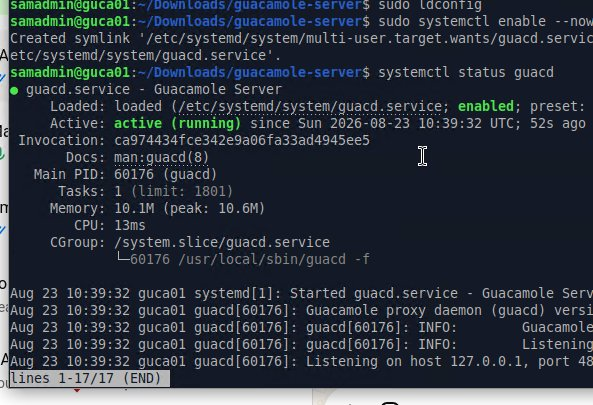

## Step 4 — Web app on Tomcat 10
```bash
sudo apt install -y tomcat10
sudo mkdir -p /etc/guacamole
```
Download `guacamole-1.6.0.war`.

> ⚠ **Error:** Tomcat log — `NoClassDefFoundError: javax/servlet/ServletContextListener`.

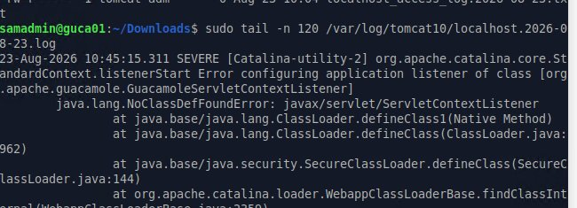

**Fix:** Tomcat 10 uses `jakarta.*`, Guacamole 1.6 still uses `javax.*`. Convert the WAR with the Jakarta migration tool:
```bash
sudo apt install -y tomcat-jakartaee-migration
sudo javax2jakarta guacamole-1.6.0.war /var/lib/tomcat10/webapps/guacamole.war
sudo systemctl restart tomcat10
```

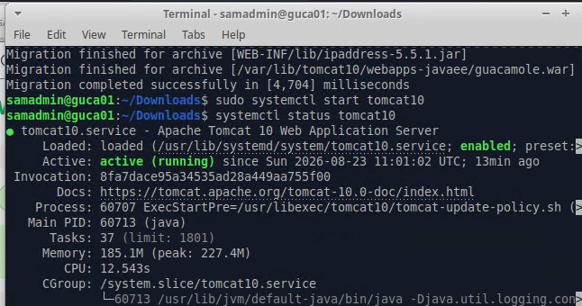

## Step 5 — guacamole.properties
```bash
sudo nano /etc/guacamole/guacamole.properties
```
```
guacd-hostname: localhost
guacd-port: 4822
```

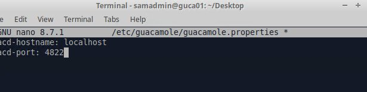

## Step 6 — Database login (MariaDB)
1. Install MariaDB, create database `guacamole_db` and user `guacamole_user` with a strong password `[REDACTED]`.
2. Copy `guacamole-auth-jdbc-mysql-1.6.0.jar` to `/etc/guacamole/extensions/` and the MySQL/MariaDB JDBC driver to `/etc/guacamole/lib/`.
3. Add to `guacamole.properties`:
```
mysql-hostname: localhost
mysql-port: 3306
mysql-database: guacamole_db
mysql-username: guacamole_user
mysql-password: [REDACTED]
```

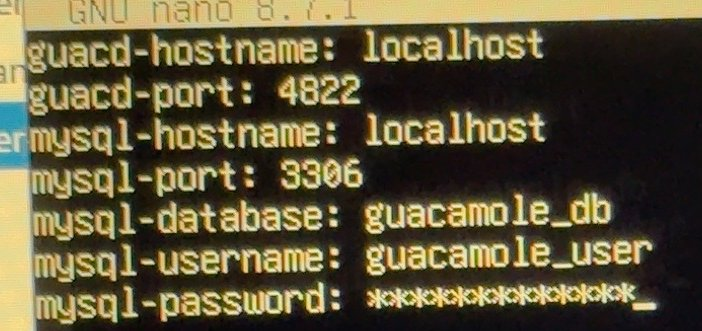

> ⚠ **Error:** Tomcat log — *"Table 'guacamole_db.guacamole_user' doesn't exist"*.

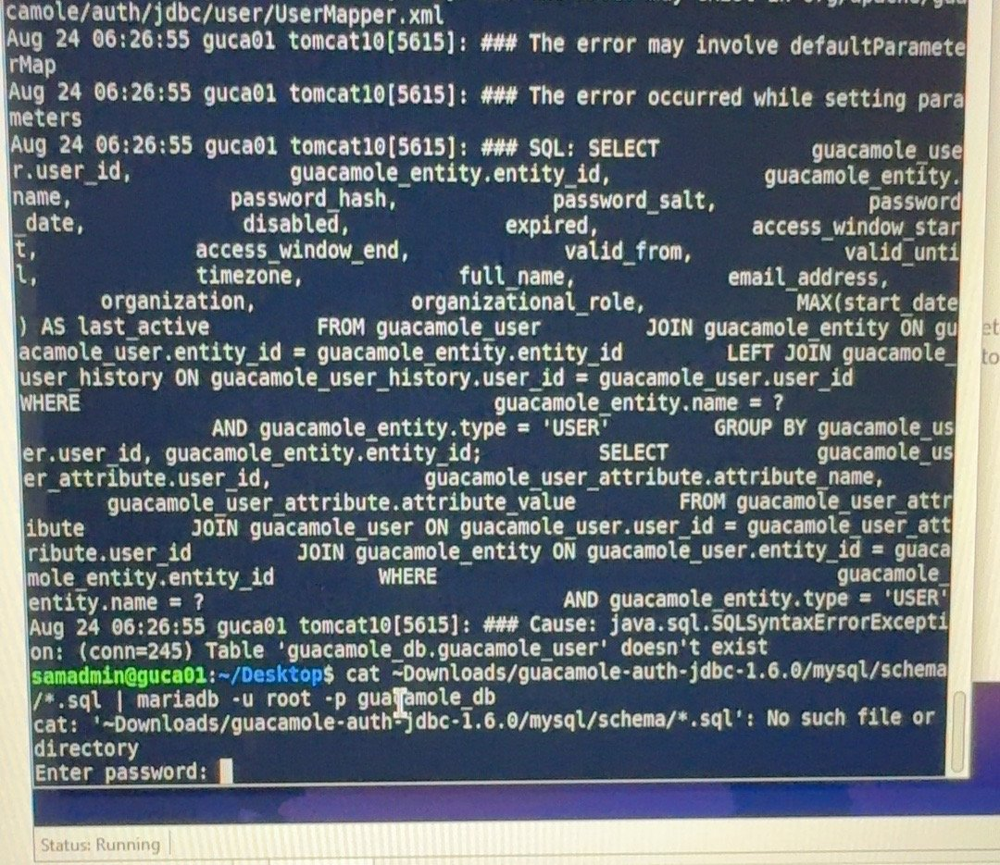

**Fix:** The schema was never imported (and the path in the command was wrong). Import it:
```bash
cat ~/Downloads/guacamole-auth-jdbc-1.6.0/mysql/schema/*.sql | sudo mariadb guacamole_db
sudo systemctl restart tomcat10
```

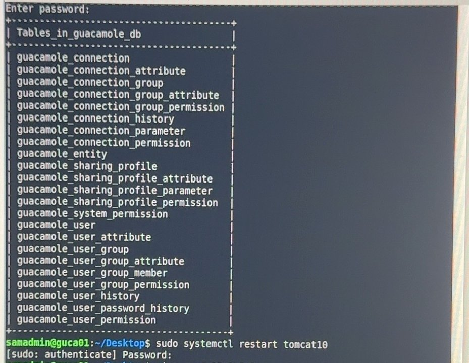

Open `http://10.0.0.11:8080/guacamole` and log in. **Change the default `guacadmin` password right away** (or create a new admin and delete `guacadmin`).

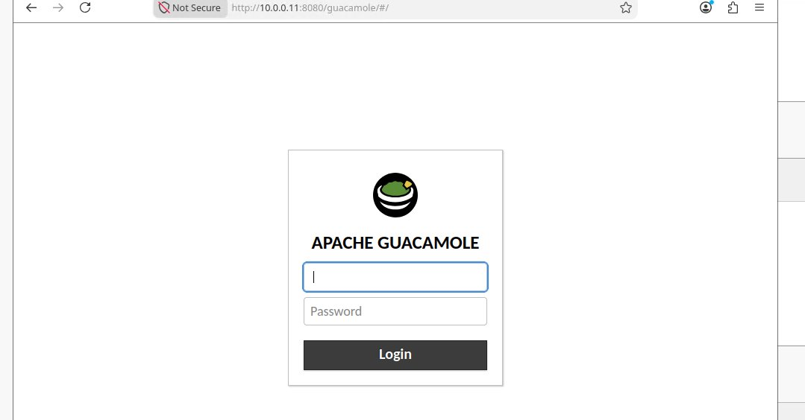

## Step 7 — Add an RDP connection (DEMO01)
**Settings > Connections > New Connection**: Protocol **RDP**, Hostname `10.0.0.9`, Port `3389`, domain `sam.lab`, Security **NLA**, check **Ignore server certificate** (lab).

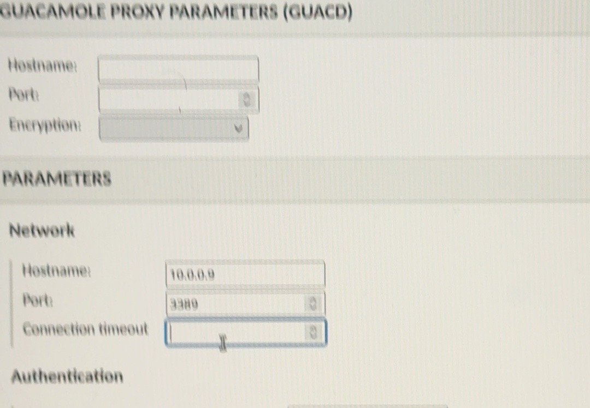

> ⚠ **Error:** `nc -zv 10.0.0.9 3389` → **Connection timed out**.
> **Fix:** Remote Desktop was off on DEMO01, and Windows Firewall blocked it. Turned on RDP (**Settings > System > Remote Desktop**) — `nc` then said **succeeded**.

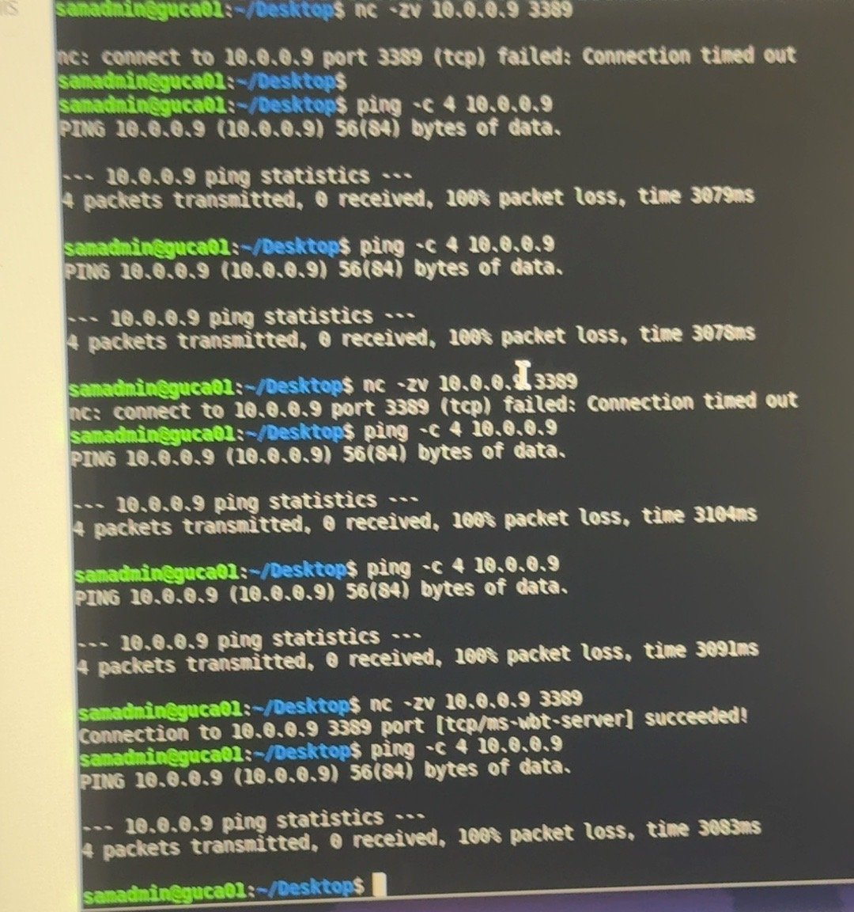

> ⚠ **Error:** guacd log — *"RDP server closed/refused connection: Authentication failure (invalid credentials?)"*.
> **Fix:** Use the domain user (`demouser`, domain `sam.lab`) and add it to **Remote Desktop Users** on DEMO01.

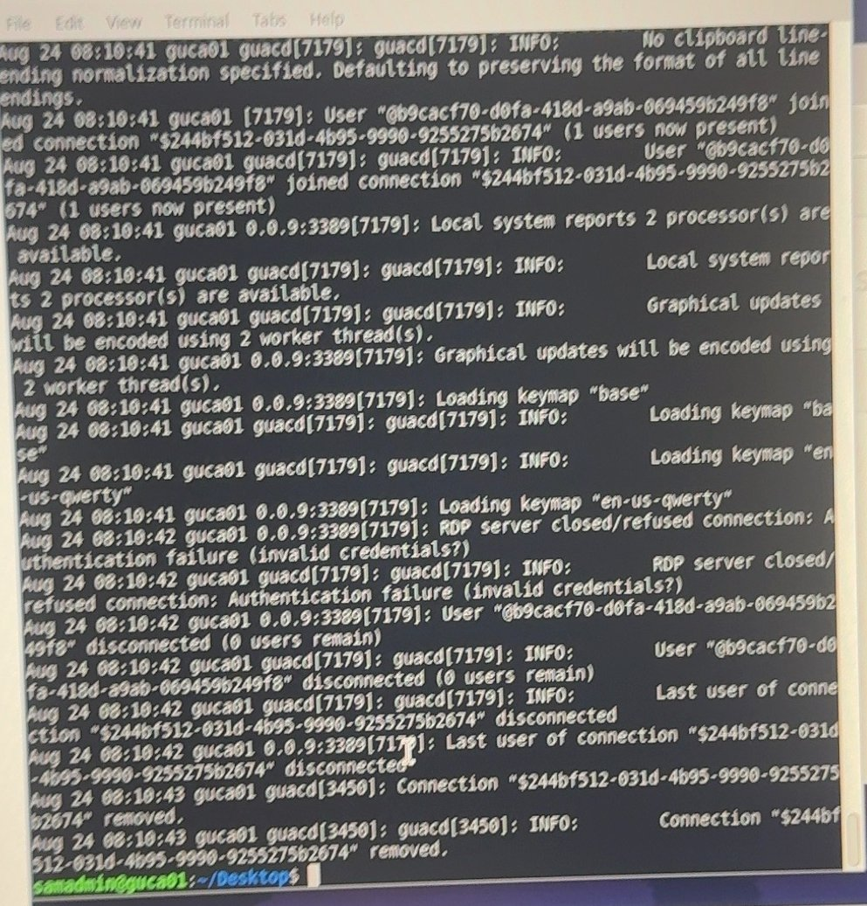

---

## ✅ Check it worked
Click **DEMO01** in Guacamole → the Windows desktop opens in the browser.

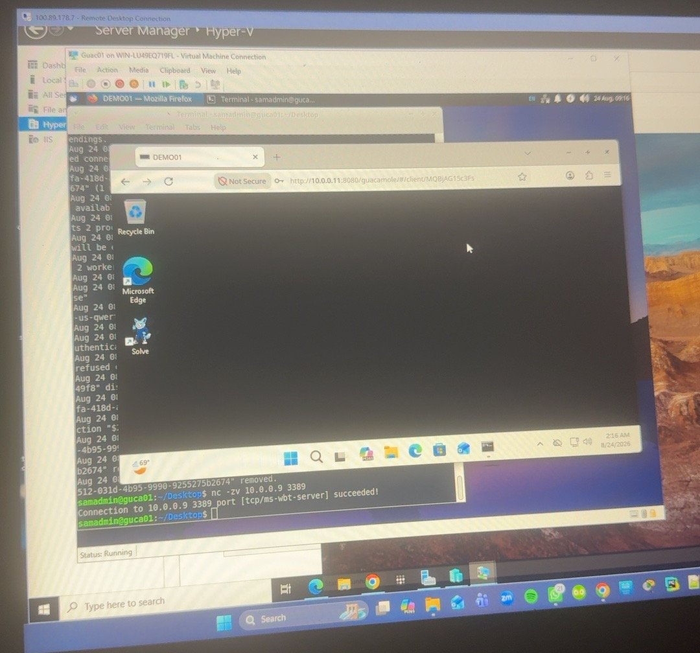

Remote access from outside: see [Cloudflare Tunnel guide](cloudflare-tunnel.md).

## 📋 Pending (not built yet)
- [ ] Static IP for GUAC01 (now DHCP) or a DHCP reservation
- [ ] **Change all passwords that appeared in old screenshots** (MariaDB root, guacamole_user, user-mapping)
- [ ] Remove old `user-mapping.xml` (MD5) now that MariaDB auth works
- [ ] TOTP (2FA) extension for Guacamole
- [ ] HTTPS with Nginx reverse proxy in front of Tomcat
- [ ] Connect Guacamole to AD with LDAP auth
- [ ] Add connections for DC01, WAC01, DEPLOYWIN (admin group only)
- [ ] Automatic updates + backup of `guacamole_db`
