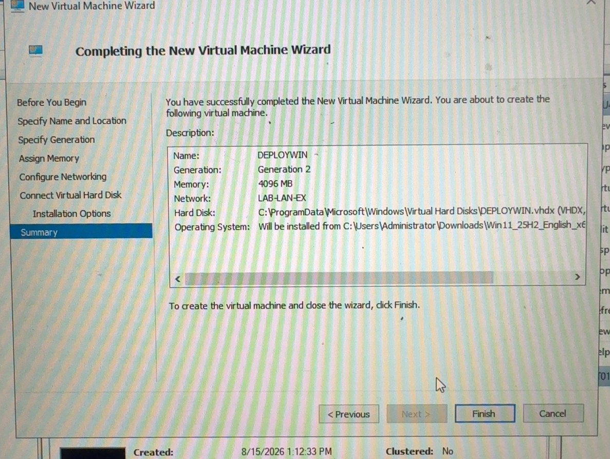
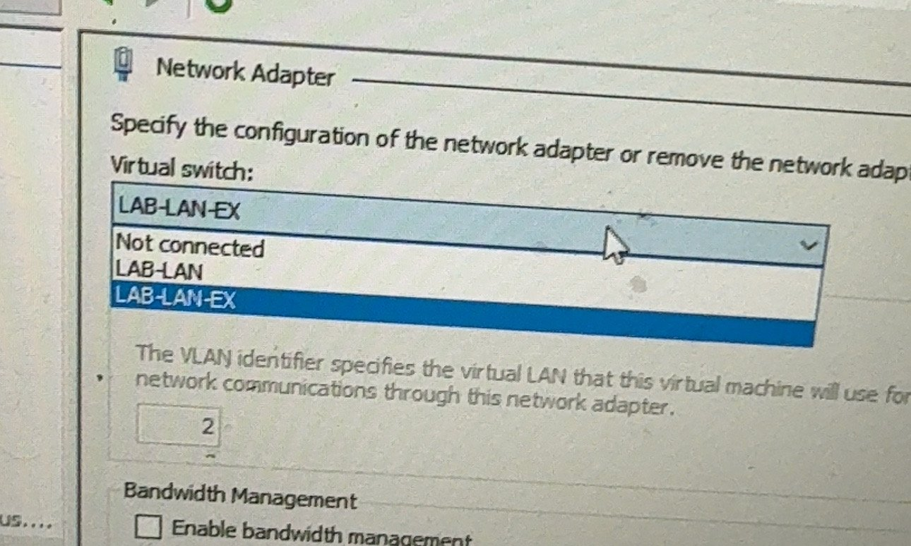
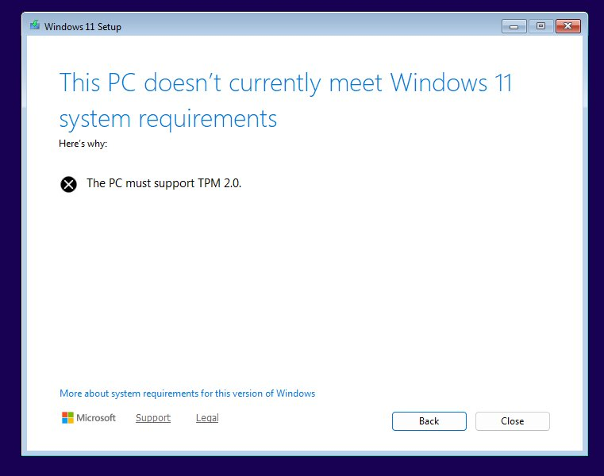
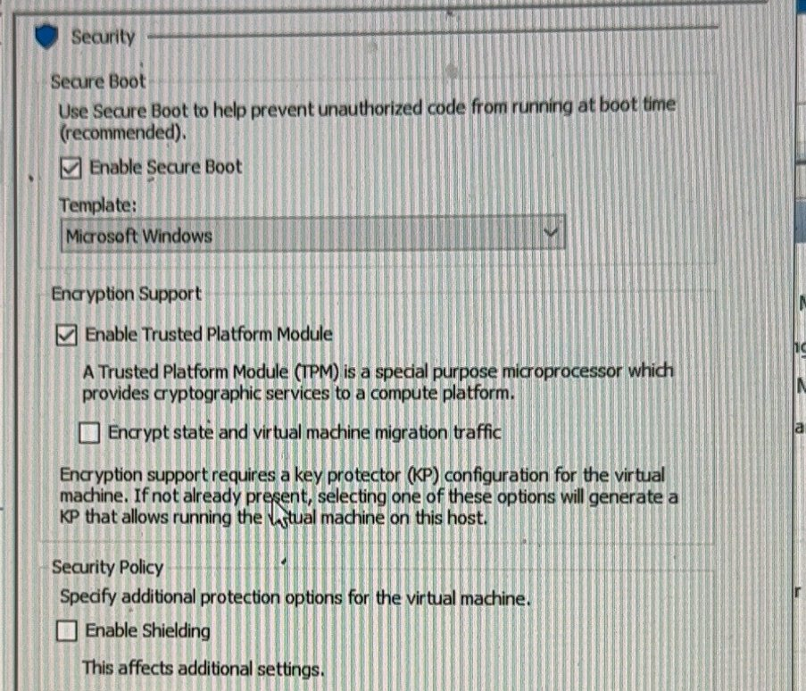
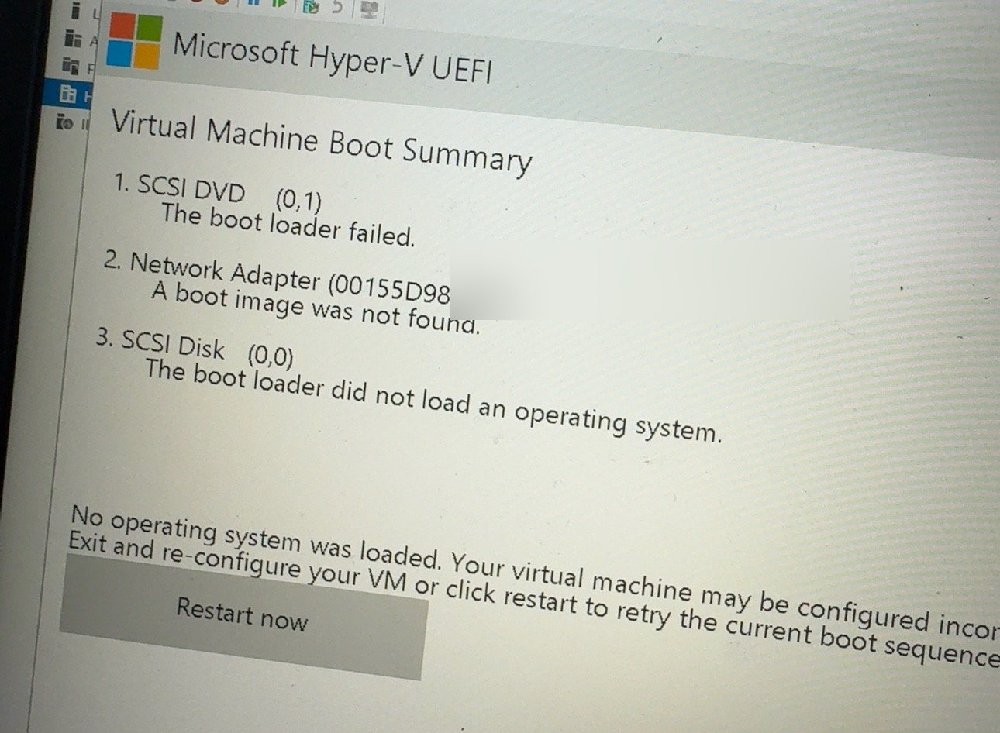
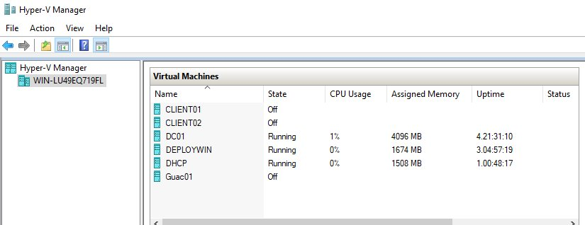

# Hyper-V Host — Step by Step

**Goal:** One physical server that runs all the lab VMs.
**Host:** WIN-LU49EQ719FL · Windows Server 2022 · i3-10105F · 24 GB RAM · IP 10.0.0.3

| Virtual switch | Type | Use |
|---|---|---|
| LAB-LAN-EX | External | VMs on the real lab LAN (10.0.0.0/24) |
| LAB-LAN | Internal | Spare isolated network |

| VM | Gen | RAM | Role |
|---|---|---|---|
| DC01 | 2 | 4096 MB | AD DS, DNS |
| DHCP | 2 | VERIFY | Windows DHCP |
| DEPLOYWIN | 2 | 4096 MB | WDS / PXE |
| DEMO01 | 2 | 6000 MB | Windows 11 test client |
| CLIENT01 / CLIENT02 | 2 | 4096 MB | Windows 11 clients |
| Guac01 | 2 | 2048 MB, 2 vCPU | Ubuntu, Apache Guacamole |

---

## Step 1 — Install Hyper-V
```powershell
Install-WindowsFeature -Name Hyper-V -IncludeManagementTools -Restart
```

## Step 2 — Create the virtual switches
1. **Hyper-V Manager > Virtual Switch Manager**.
2. New **External** switch `LAB-LAN-EX`, bound to the physical NIC, check **Allow management OS to share**.
3. New **Internal** switch `LAB-LAN`.

Check:
```powershell
Get-VMSwitch
```

## Step 3 — Create a VM (example: DEPLOYWIN)
1. **Action > New > Virtual Machine**.
2. Name `DEPLOYWIN`, **Generation 2**, Memory `4096 MB`, Network `LAB-LAN-EX`.
3. New virtual hard disk, attach the install ISO, **Finish**.



## Step 4 — Connect the VM to the lab network
1. **VM Settings > Network Adapter > Virtual switch** = `LAB-LAN-EX`.



> ⚠ **Error:** VM got a 169.254.x.x (APIPA) address and could not reach the DC.
> **Fix:** It was on `LAB-LAN` (internal). Switched it to `LAB-LAN-EX`.

## Step 5 — Windows 11 VMs need TPM
> ⚠ **Error:** *"This PC doesn't currently meet Windows 11 system requirements — The PC must support TPM 2.0."*



**Fix:** Turn the VM off, then **Settings > Security**: check **Enable Secure Boot** (template *Microsoft Windows*) and **Enable Trusted Platform Module**.



## Step 6 — Boot order
> ⚠ **Error:** *"Virtual Machine Boot Summary — The boot loader failed / A boot image was not found."*



**Fix:** **Settings > Firmware** → move **DVD Drive** to the top, then start the VM and **press a key** quickly when it says *Press any key to boot from CD or DVD*.

---

## ✅ Check it worked


```powershell
Get-VM | Select Name, State, MemoryAssigned, Generation
Get-VMNetworkAdapter -VMName * | Select VMName, SwitchName
```

## 📋 Pending (not built yet)
- [ ] Set Hyper-V host to a static IP (10.0.0.3) — VERIFY
- [ ] VM checkpoints before big changes (naming standard)
- [ ] VM backups (Windows Server Backup or Veeam Community)
- [ ] Hyper-V Replica or export schedule
- [ ] New VMs: CM01 (SCCM), SIEM01 (Wazuh), MON01 (Zabbix), KALI01
- [ ] Separate VLAN / vSwitch for Kali test segment
- [ ] Remove Tailscale now that IPsec VPN works
