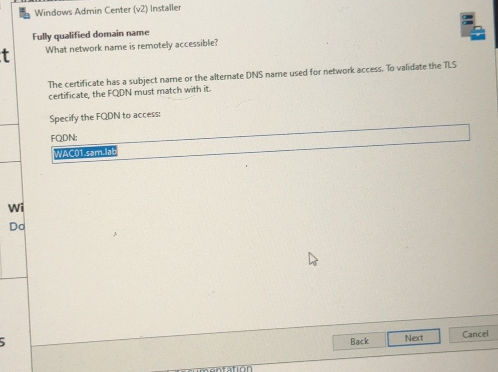
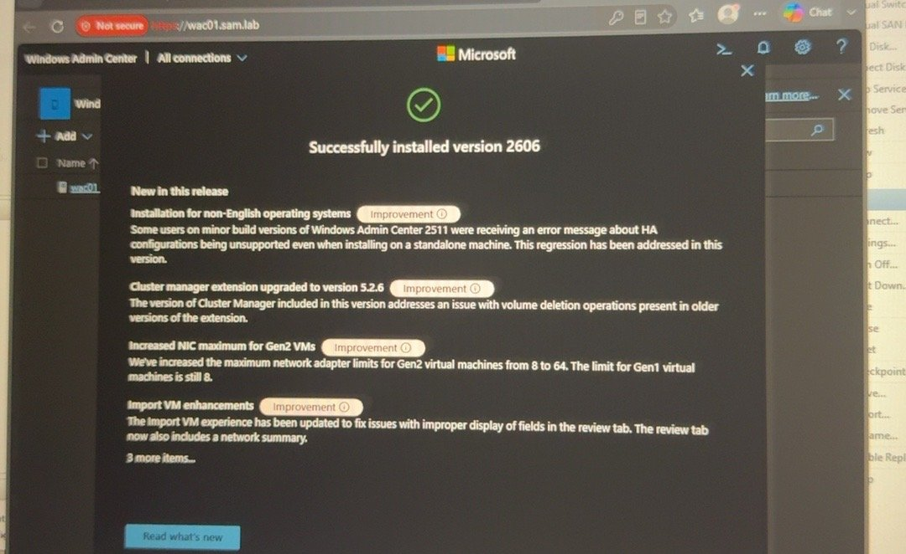
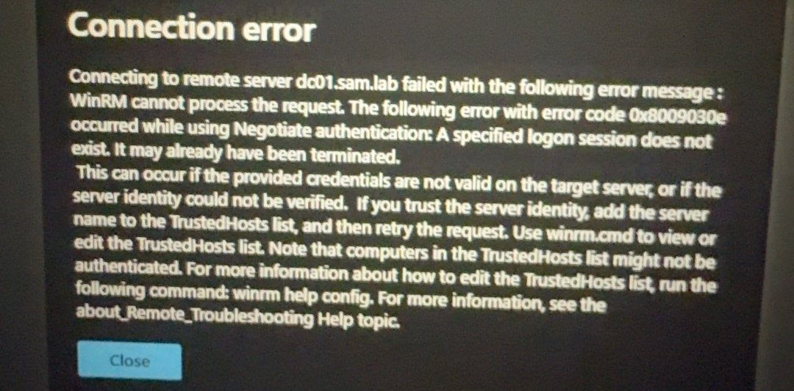
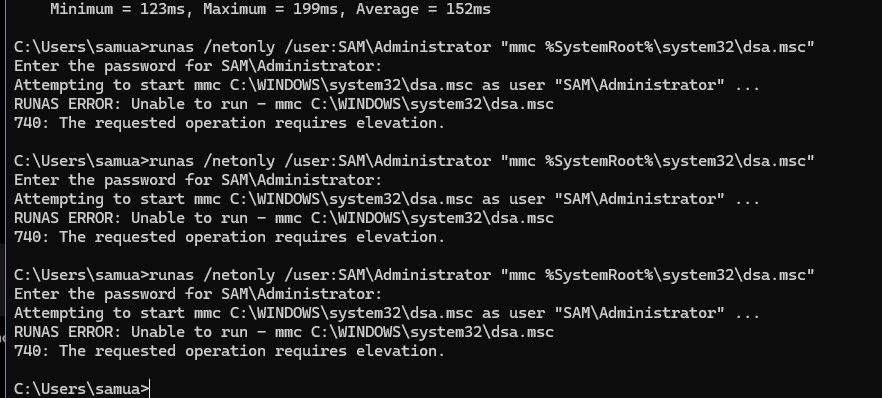

# WAC01 — Windows Admin Center + RSAT — Step by Step

**Goal:** Manage all servers from a browser instead of logging into each one.
**Status:** ✅ Built
**Server:** WAC01 · IP 10.0.0.7 · URL `https://wac01.sam.lab` · WAC version 2606

---

## Step 1 — Install Windows Admin Center
1. Download WAC from Microsoft Evaluation Center onto WAC01.
2. Run the installer. **FQDN** = `WAC01.sam.lab`.
3. Certificate: **self-signed** (lab). WinRM over HTTP, port 443 for the web UI.





## Step 2 — Open WAC
From a LAN or VPN PC: `https://wac01.sam.lab` → accept the certificate warning (self-signed).

## Step 3 — Add servers
**+ Add > Servers** → `dc01.sam.lab`, `deploywin.sam.lab`, etc. Use **SAM\Administrator** (domain), not `WAC01\Administrator`.

> ⚠ **Error:** *"Connecting to remote server dc01.sam.lab failed … WinRM … 0x8009030e … A specified logon session does not exist."*
> **Fix:** WAC was using the **local** account `WAC01\Administrator`. Click **Manage as** and enter `SAM\Administrator`.



## Step 4 — RSAT on the admin laptop (Windows 11 Pro)
```powershell
Add-WindowsCapability -Online -Name "Rsat.ActiveDirectory.DS-LDS.Tools~~~~0.0.1.0"
Get-WindowsCapability -Online -Name RSAT.ActiveDirectory*
```

> ⚠ **Error:** `runas /netonly /user:SAM\Administrator "mmc dsa.msc"` → **740: The requested operation requires elevation.**
> **Fix:** Open **Command Prompt as administrator** first, then run the same `runas` command.



---

## ✅ Check it worked
- `https://wac01.sam.lab` opens and DC01 shows **Connected**.
- On the laptop:
```powershell
nslookup sam.lab
Test-NetConnection dc01.sam.lab -Port 5985
```

## 📋 Pending (not built yet)
- [ ] Remove TrustedHosts `*` set by the installer
- [ ] Replace self-signed cert with one from an internal AD CS
- [ ] Use WinRM over HTTPS (5986)
- [ ] Add every server (DHCP, DEPLOYWIN, FILE01, WEB01 via firewall rule)
- [ ] Restrict WAC access to `GG_IT_Users` only
- [ ] Confirm ADUC opens `sam.lab` from the laptop over VPN
