# FOR01 — Forensics Workstation with Autopsy — Step by Step

**Goal:** A dedicated, isolated-by-design VM for digital forensics, built fully remote over the VPN.
**Status:** ✅ Autopsy working · 🟠 hardening pending
**VM:** FOR01 · Windows 11 Pro 25H2 · Hyper-V Gen 2 · 4 vCPU · 6 GB fixed RAM · vTPM + Secure Boot · **10.0.0.12** static
**Disks:** C: 64 GB (OS) · E: 50 GB **Evidence** (`E:\Cases`, `E:\Evidence`)
**Tools:** Autopsy 4.23.1 · HxD Hex Editor 2.5

| Design choice | Why |
|---|---|
| **Not domain-joined** (local user) | Malware inside evidence can't touch domain credentials |
| Separate evidence disk | Cases stay off the OS disk; easy to encrypt and back up |
| Fixed RAM | Java (Autopsy) doesn't like memory being taken away |
| Correct time zone | Timelines in forensics depend on it |

---

## Step 1 — Check the host has room
Over the VPN, open a remote session to the Hyper-V host (see [Hyper-V guide](../04-servers/hyper-v.md)).
```powershell
[math]::Round((Get-CimInstance Win32_OperatingSystem).FreePhysicalMemory/1MB,1)
Get-Volume | Where DriveLetter | Select DriveLetter, @{n='FreeGB';e={[math]::Round($_.SizeRemaining/1GB)}}
```
Only ~6 GB RAM and 167 GB disk were free, so FOR01 was sized at 6 GB RAM and 64 + 50 GB disks.

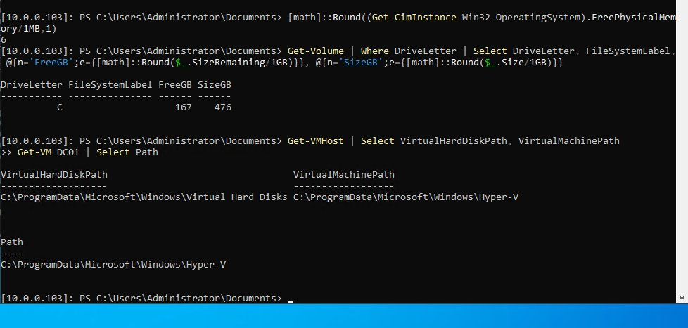

## Step 2 — Create the VM
```powershell
$vm = "FOR01"
New-VM -Name $vm -Generation 2 -MemoryStartupBytes 6GB -NewVHDPath "C:\ProgramData\Microsoft\Windows\Hyper-V\FOR01\FOR01.vhdx" -NewVHDSizeBytes 64GB -SwitchName "LAB-LAN-EX"
Set-VMMemory -VMName $vm -DynamicMemoryEnabled $false
Set-VMProcessor -VMName $vm -Count 4
New-VHD -Path "C:\ProgramData\Microsoft\Windows\Hyper-V\FOR01\FOR01-Evidence.vhdx" -SizeBytes 50GB -Dynamic
Add-VMHardDiskDrive -VMName $vm -Path "C:\ProgramData\Microsoft\Windows\Hyper-V\FOR01\FOR01-Evidence.vhdx"
Set-VMKeyProtector -VMName $vm -NewLocalKeyProtector
Enable-VMTPM -VMName $vm
Add-VMDvdDrive -VMName $vm -Path $iso
Set-VMFirmware -VMName $vm -FirstBootDevice (Get-VMDvdDrive -VMName $vm)
```

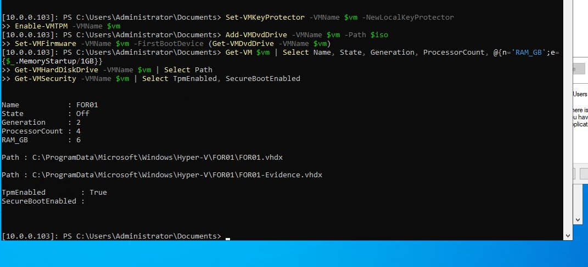

## Step 3 — Install Windows 11
Install to **Disk 0 (64 GB)** only. Name the PC `FOR01`, use a **local account** (no domain join).

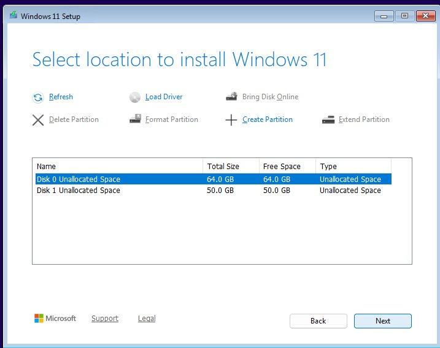

## Step 4 — Time zone and static IP
```powershell
Set-TimeZone -Id "Central Standard Time"
```
IP `10.0.0.12/24`, gateway `10.0.0.1`, DNS `10.0.0.4`. A static IP lets pfSense rules target FOR01 later.

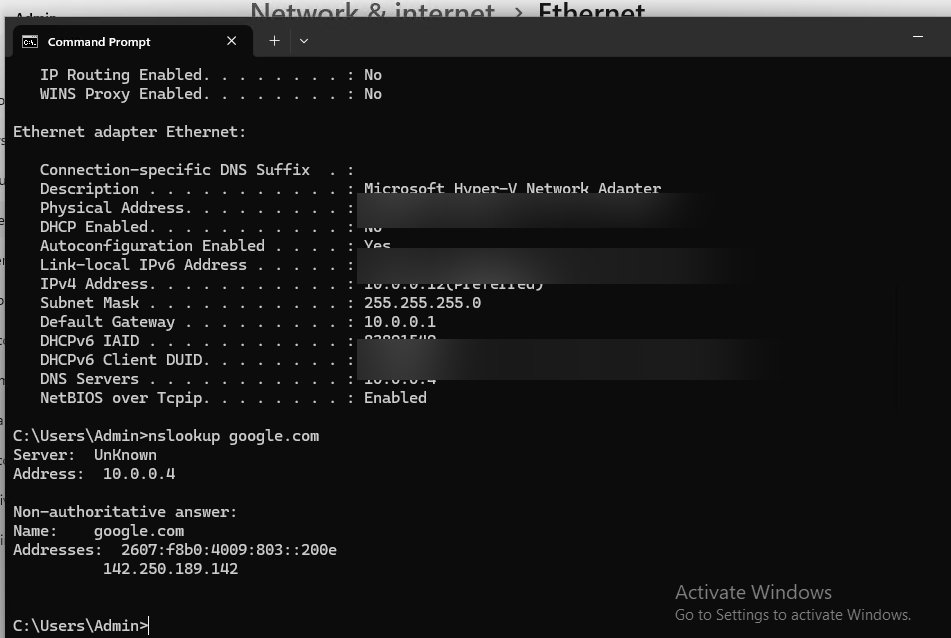

## Step 5 — Evidence disk E:
**Disk Management** → Disk 1 → GPT → New Simple Volume → NTFS, label **Evidence**, letter **E:**. Create `E:\Cases` and `E:\Evidence`.

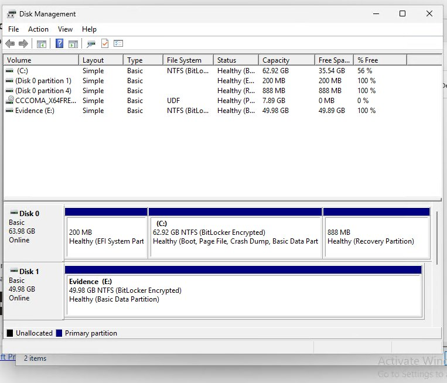

## Step 6 — Download and verify Autopsy
Download `autopsy-4.23.1-64bit.msi` from the official GitHub releases page, then compare the hash with the one published there:
```powershell
Get-FileHash "$env:USERPROFILE\Downloads\autopsy-4.23.1-64bit.msi" -Algorithm SHA256
```

> ⚠ **Error:** *Cannot validate argument on parameter 'Algorithm'. The argument "SHA" does not belong to the set…*
> **Fix:** Typo — `SHA 256` has a space. Use `SHA256`.

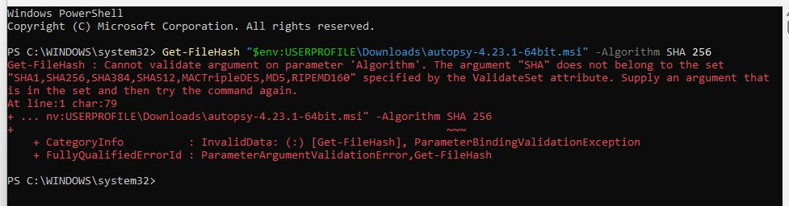

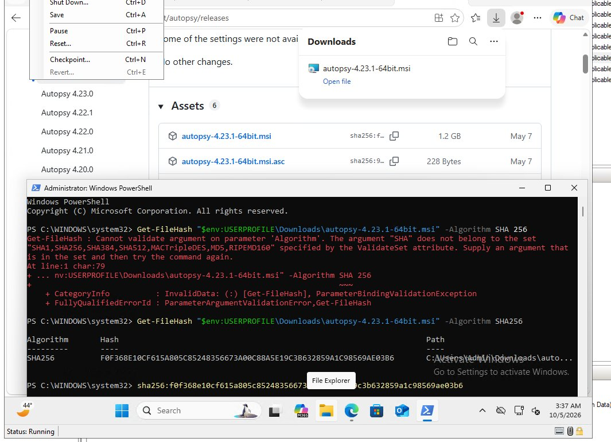

Why: verifying the hash proves the installer wasn't tampered with — a basic forensics habit.

## Step 7 — Checkpoint, then install
Take a Hyper-V checkpoint (*FOR01 – Win11 clean – before Autopsy*), then run the MSI with defaults.

> ⚠ **Error:** *Problem with Sleuth Kit JNI. Test call failed. Is Autopsy or Cyber Triage already running?*
> **Fix:** Autopsy was reopened too fast — the old Java process was still running. End the leftover process, wait 30 seconds, open again.

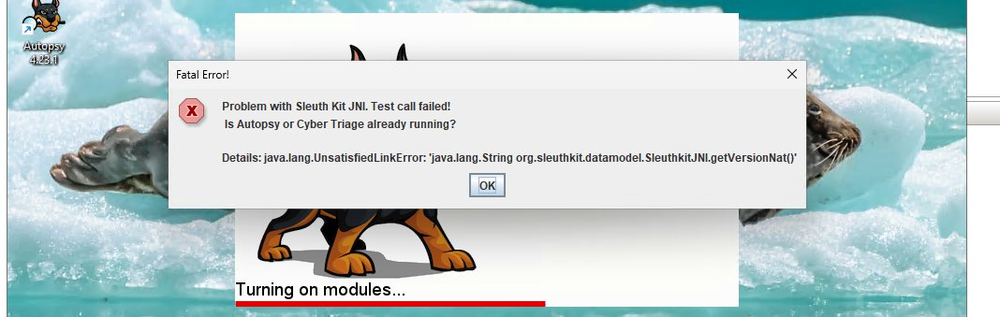

## Step 8 — Tune memory
**Tools > Options > Application**: Maximum JVM memory **3 GB**, Maximum Solr JVM memory **1024 MB**. Restart Autopsy.

> ⚠ **Problem:** Default Solr 2048 MB + JVM 3 GB left Windows almost no RAM on a 6 GB VM.
> **Fix:** Lower Solr to 1024 MB (leaves ~2 GB for Windows).

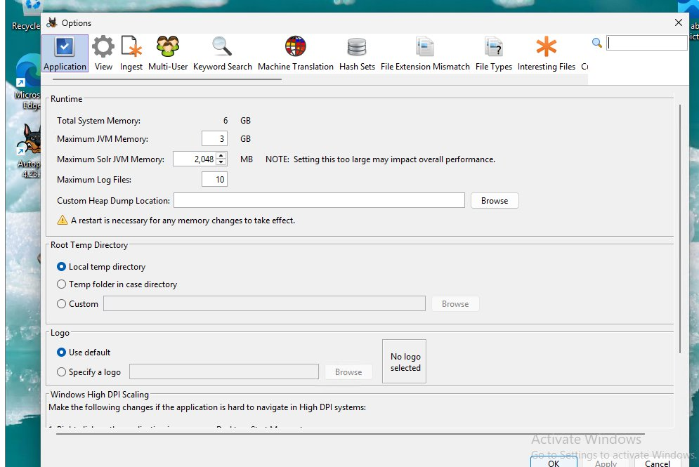

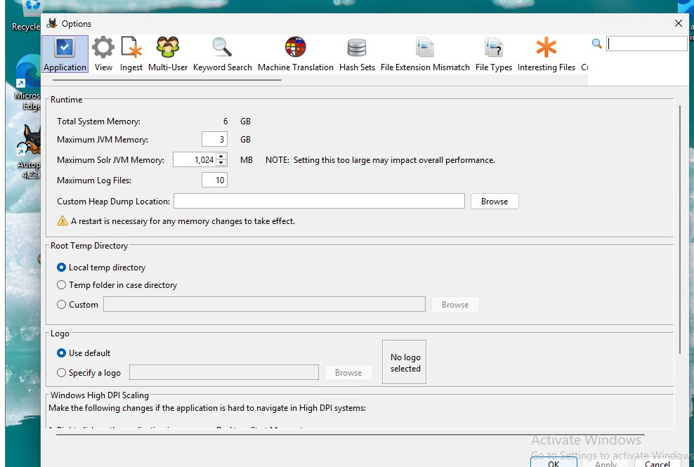

## Step 9 — Encrypt with BitLocker
Run `manage-bde -status` from an **elevated** terminal.

> ⚠ **Error:** *An attempt to access a required resource was denied.*
> **Fix:** The terminal wasn't elevated — use **Terminal (Admin)**.

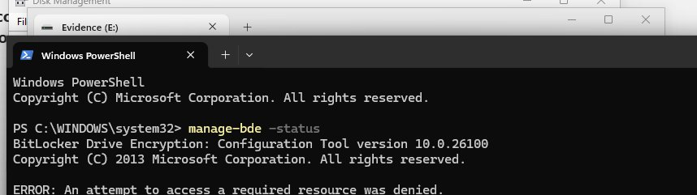

---

## ✅ Check it worked
| Check | Expected |
|---|---|
| `ipconfig /all` | 10.0.0.12, DHCP No, DNS 10.0.0.4 |
| `nslookup google.com` | Answer from 10.0.0.4 |
| `Get-Volume E` | Evidence, ~50 GB |
| Autopsy **Help > About** | 4.23.1 |
| **Tools > Options** | JVM 3 GB, Solr 1024 MB |

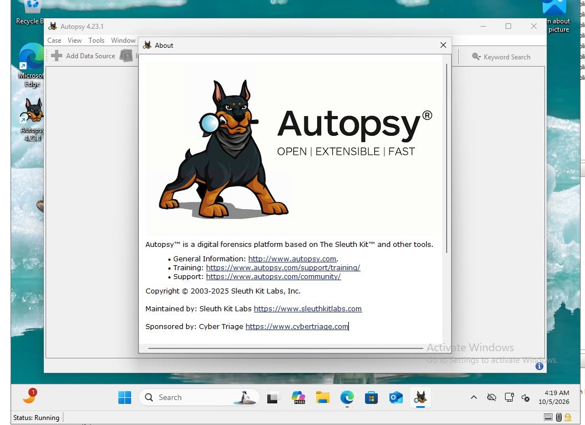

**First case done:** a college lab exercise (CSCI 2842) analyzed in Autopsy, stored in `E:\Cases`.

## 📋 Pending (not built yet)
- [ ] Finish BitLocker on C: (*waiting for activation*) and save C:/E: recovery keys in a password manager
- [ ] Defender exclusions for `E:\Evidence` and `E:\Cases` (VM is slow during scans)
- [ ] Move FOR01 to its own pfSense segment / VLAN (now shares the LAN with DC01)
- [ ] Rename local admin from `Admin`; use a standard user for daily work
- [ ] Separate data SSD on the host for VM disks
- [ ] Practice images from NIST CFReDS
- [ ] Add more tools: FTK Imager, Eric Zimmerman tools, Volatility
